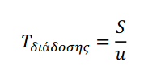
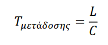

# Αρχές Αξιόπιστης Μεταφοράς Δεδομένων

Γενικό πρόβλημα: Υπάρχει πρόβλημα αξιόπιστης μεταφοράς δεδομένων τόσο στο επίπεδο μεταφοράς όσο **και στο επίπεδο ζεύξης και δικτύου**.

Με ένα αξιόπιστο κανάλι, τα μεταφερόμενα bit δεδομένων 
1. δεν αλλοιώνονται,
2. δεν χάνονται και
3. παραδίδονται όλα  με τη σωστή σειρά.

Το **πρωτόκολο αξιόπιστης μεταφοράς δεδομενων (Reliable data trasfer protocol)** κάνει αυτή τη δουλίτσα.

## RDT 1.0: Ουτοπία

- Η πιο απλή περίπτωση
- Θεωρούμε ότι το κανάλι είναι **πλήρως αξιόπιστο** 
- Έχουμε 
  - Ο Αποστολέας
    - έχει μια κατάσταση (state)
    - Δέχεται δεδομένα απ'το ανώτερο επίπεδο
    - Δημιουργεί πακέτο
    - Στέλνει πακέτο στο κανάλι
  - Ο Δέκτης
    - έχει μια κατάσταση (state)
    - Δέχεται ένα πακέτο από το κανάλι
    - Αφαιρεί τα δεδομένα από το πακέτο
    - Περνά τα δεδομένα στο ανώτερο επίπεδο.
- Δεν υπάρχει διαφορά μεταξύ μονάδα δεδομένου και πακέτο. 
- Όλη η ροή γίνεται από τον αποστολέα προς τον παραλήπτη.
- **Θεωρούμε πως τίποτα δεν θα πάει στραβά.**

## RDT 2.0: Έσκασε Ρεαλισμός

- Πιθανή **αλλοίωση** πακέτου

- Χρήση Θετικών και αρνητικών Επιβεβαιώσεων
  - **ACK & NAK**
- Αυτά τα πρωτόκολλα ονομάζονται **ARQ (Automatic Repeat reQuest)**
- Έχει 3 Δυνατότητες
  1. **Ανίχνευση Σφαλμάτων**: Απαιτείται μηχανισμός για ανίχνευση αλλοιωμένου bit. Όπως στο UDP, χρησιμοποιείται το **πεδίο αθροίσματος ελέγχου - Checksum**
  2. **Ανάδραση Παραλήπτη**: Ο παραλήπτης θα πρέπει να **ενημερώνει τον αποστολέα** για σωστή η εσφαλμένη λήψη πακέτου μέσω μηνυμάτων **ACK & NAK** αντίστοιχα.
  3. **Επαναμετάδοση**: Ένα πακέτο που **λαμβάνεται λανθασμένα**, πρέπει να επαναμεταδίδεται από τον αποστολέα. 
- **Ο αποστολέας**
  - έχει 2 καταστάσεις
    1. Αναμονή δεδομένων από το επίπεδο εφαρμογής
    2. Αναμονή επιβεβαίωσης από παραλήπτη
       - Αν ACK
         - Επιστροφή στο 1. για αναμονή επόμενου πακέτου προς αποστολή
       - Αν NAK
          - Επαναμετάδοσε το τελευταίο πακέτο και επιστροφή στο 2.
     - **Δεν μπορεί** να στείλει τα επόμενα πακέτα μέχρι να επιβεβαιωθεί πως έχει γίνει **σωστή λήψη του τελευταίου.**
- Γνωστό ως πρωτόκολλο **παύσης-και-αναμονής (stop-and-wait)**
- **Ο παραλήπτης**
  - Παίζει με μια κατάσταση
  - Στέλνει μια απάντηση ανάλογα με την ποιότητα της λήψης
  

### RDT 2.1: Κι αν λουστεί η απάντηση; 
Τι γίνεται όμως αν αλλοιωθεί μια απάντηση ACK / NAK?

Στο RDT 2.1
- Ο αποστολέας
  - αριθμεί τα πακέτα δεδομένων του, εισάγοντας έναν αριθμό ακολουθίας (sequence number)

  - Έχει 4 καταστάσεις

    1. **Αναμονή δεδομένων** από επίπεδο εφαρμογής
       - Αποστολή δεδομενων με SEQ = 0 

    2.  **Αναμονή απόκρισης** παραλήπτη
        - ΑΝ ACK: Επιστροφή στο 1
        - ΑΝ NAK: Πήγαινε στην κατάσταση 3

    3. **Ετοιμότητα** για Επαναμετάδοση
       - Εφόσον ήρθε NAK, Επαναμετάδοσε με SEQ = 1 

    4. Αναμονή ACK ή NAK **Επαναμετάδοσης** 
        - ΑΝ ACK: Επιστροφή στο 1
        - ΑΝ NAK: Πήγαινε στην κατάσταση 3

- Ο παραλήπτης
  - Έχει 2 καταστάσεις
    1. Αναμονή πακέτου με SEQ = 0
       - Αν σωστή λήψη: 
         - Απάντηση με ACK
         - Αναμονή για επόμενο πακέτο 
       - Αν λανθασμένη λήψη: 
         - Απάντηση με NAK
         - Πήγαινε στην κατάσταση 2
    2. Αναμονή πακέτο με SEQ = 1
       - Αν σωστή λήψη:
         - Απάντηση με ACK
         - Επιστροφή στο 1
       - Αν λανθασμένη λήψη:
         - Απάντηση με ΝΑΚ
         - Αναμονή για Επαναμετάδοση
- Ελέγχει εάν το ληφθέν πακέτο είναι μια αναμετάδοση.

### RDT 2.2: Αυτό το ACK, για ποιο είναι;

Επειδή δεν είναι γνωστό για ποιο πακέτο έστειλε ο παραλήπτης επιβεβαίωση, στο RDT 2.2
- Ο παραλήπτης
  - Περιλαμβάνει στην επιβεβαίωση και τον αριθμό ακολουθίας πακέτου.

### RDT 3.0: Το πακέτο ξεγλίστρησε

Τι γίνεται όταν ένα πακέτο χαθεί; Τότε ο αποστολέας δεν θα ενημερωθεί ποτέ για την ποιότητα λήψης πακέτου του παραλήπτη.

Στο RDT 3.0
- Ο αποστολέας **επιπλέον**
  - Κατέχει ένα **χρονομετρητή αντίστροφης μέτρησης**
  - Επιλέγει μια διακριτική τιμή χρόνου.
  - Εκκινεί το χρονομετρητή με κάθε αποστολή πακέτου
  - Αν δεν ληφθεί κάποια απάντηση μέχρι τη διακοπή χρονομετρητή, επαναμετάδοσε.
  - Παύση χρονομετρητή στη λήψη επιβεβαίωσης.
- Επειδή οι αριθμοί ακολουθίας πακέτων εναλλάσονται ανάμεσα στο 0 και 1, το πρωτόκολλο είναι γνωστό ως **πρωτόκολλο εναλλασόμενου bit**

## Πρωτόκολλα Αξιόπιστης Μεταφοράς με Διοχέτευση

Το rdt3.0 δουλεύει καλά, αλλά δεν εκμεταλλεύεται πλήρως τη χωρητικότητα της ζεύξης. 

### Μέτρηση Καθυστερήσεων

Έχουμε 2 βασικές καθυστερήσεις

- Καθυστέρηση μετάδοσης
- Καθυστέρηση διάδοσης

Ο χρόνος διάδοσης είναι ο χρόνος πουαπαιτείται για να ταξιδέψει το σήμα στο μέσο μετάδοσης, από την πηγή στον προορισμό. Πρακτικά ταυτίζεται με το χρόνο που περνάει **από τη στιγμή που στέλνεται το πρώτο bit** από την πηγή στο μέσο μετάδοσης μέχρι τη στιγμή **που το πρώτο bit(ενός πλαισίου) καταφθάνει στον προορισμό**. Ο χρόνος διάδοσης δεν έχει σημαντικές διαφορές από μέσο σε μέσο και αγγίζει περίπου τα 5ns/m, δηλαδή **u** = 200.000.000 m/s. Ως εκ τούτου, ο χρόνος διάδοσης εξαρτάται αποκλειστικά από την απόσταση **S** του αποστολέα και του παραλήπτη:

Ο  **χρόνος  μετάδοσης**  είναι  ο  χρόνος  που  χρειάζεται  ο  πομπός  για  **να  εισάγει  την πληροφορία (ενός πλαισίου) στο μέσο μετάδοσης**. Πρακτικά ταυτίζεται με το χρόνο που περνάει από τη στιγμή που ο πομπός διαμορφώνει και εισάγει στο μέσο μετάδοσης το **πρώτο** bit μέχρι τη στιγμή που διαμορφώνει και εισάγει στο μέσο μετάδοσης το **τελευταίο** bit. Για παράδειγμα σε μία ζεύξη που υποστηρίζει ρυθμό μετάδοσης 64 Kbps ο χρόνος που χρειάζεται για να μεταδοθούν τα 64000 bits είναι 1 sec. Ο χρόνος μετάδοσης εξαρτάται από το **μέγεθος L** της πληροφορίας (ενός πλαισίου) που στέλνουμε και από τη **χωρητικότητα C** της ζεύξης μεταξύ του αποστολέα και του παραλήπτη, σύμφωνα με την παρακάτω σχέση:

| Μεταβλητή | Μονάδα Μέτρησης |
| :-------: | :-------------: |
|     S     |     μέτρα m     |
|     u     |       m/s       |
|     L     |      bits       |
|     C     |    bits / s     |

### Διοχέτευση - Pipelining

Αντί να λειτουργεί ο αποστολέας με παύση και αναμονή, ο αποστολέας στέλνει πολλαπλά πακέτα χωρίς να περιμένει επιβεβαίωση. Η διοχέτευση έχει τις παρακάτω συνέπειες:

1. **Το εύρος ζώνης αριθμών ακολουθίας αυξάνεται**: Κάθε σε-διέλευση πακέτο πρέπει να έχει το δικό του αριθμό ακολουθίας διότι μπορούν να υπάρχουν πολλά διερχόμενα πακέτα που δεν έχουν επιβεβαιωθεί.
2. Και οι 2 πλευρές μπορεί να χρειαστούν ενταμιευτές για 1+ πακέτα.
   - **Ο αποστολέας** πρέπει να ενταμιεύει πακέτα που έχουν μεταδοθεί αλλά δεν έχουν επιβεβαιωθεί.
   - **Ο παραλήπτης** πρέπει να ενταμιεύει σωστά ληφθέντα πακέτα εκτός σειράς.
   - Οι απαιτήσεις ενταμίυεσης και το εύρος αριθμών ακολουθίας εξαρτώνται από το πρωτόκολλο που θα χρησιμοποιηθεί.

### Go-Back-N GBN

> <a href="https://media.pearsoncmg.com/aw/ecs_kurose_compnetwork_7/cw/content/interactiveanimations/go-back-n-protocol/index.html">Άσκηση Προσωμοίωσης</a>

- Ο αποστολέας μπορεί να στέλνει πολλαπλά πακέτα χωρίς την αναμονή επιβεβαίωσης **με περιορισμό σε ένα μέγιστο επιτρεπόμενων ο αριθμό  μη επιβεβαιωμένων πακέτων Ν**

ΣΕ ένα παράθυρο, θεωρούμε με αριθμό ακολουθίας
- **base**: το πακέτο του παλαιότερου μη επιβεβαιωμένου πακέτου
- **nextseqnum**: τον μικρότερο αριθμό ακολουθίας που δεν χρησιμοποιήθηκε, δηλαδή το επόμενο προς απόστολή πακέτου.
  
  Έτσι δημιουργούνται 4 διαστήματα εύρους.

  1. \[0, base-1]: Πακέτα που έχουν ήδη μεταδοθεί και επιβεβαιωθεί.
  
  2. \[base, nextseqnum-1]: Πακέτα που έχουν σταλεί αλλά δεν έχουν ακόμη επιβεβαιωθεί

  3. \[nextseqnum, nextseqnum+base-1]: Αριθμοί ακολουθίας που μπορούν να χρησιμοποιηθούν μόλις φτάσουν δεδομένα από το επίπεδο εφαρμογής
  
  4. \[base+N, ++]: Δεν μπορούν να χρησιμοποιηθούν μέχρι να γίνει επιβεβαίωση ενός μη επιβεβαιωθέντος πακέτου που βρίσκεται μέσα στη διοχέτευση - **του base.**

Θεωρούμε τον **αριθμό Ν** ως το μέγεθος του παραθύρου. Κάθε φορά που επιβεβαιώνεται το πακέτο base, ο παράθυρο ολισθαίνει προς τα δεξιά. Για αυτό το GBN είναι επίσης γνωστό ως **πρωτόκολλο ολισθαίνοντας παραθύρου.** 

**Ο αποστολέας** GBN αποκρίνεται σε 3 τύπους συμβάντων

1. **Κλήση από πάνω**:
   - Έλεγχος αν το παράθυρο είναι γιομάτο.
     - Αν δεν είναι, δημιουργία και αποστολή πακέτου.
     - Αν είναι, στέλνει τα δεδομένα πίσω από εκεί που ήρθαν (Επίπεδο Εφαρμογής), για αργότερη προσπάθεια
   - **Λήψη ενός ACK**: 
     - Μια επιβεβαίωση θεωρείται **συσσωρευτική**. Όλα τα πακέτα με αριθμό ακολουθίας μέχρι και το n έχουν ληφθεί σωστά από τον παραλήπτη
   - **Συμβάν λήξης Χρόνου**:
     - Επαναμετάδοση πακέτων που έχουν σταλεί αλλά δεν έχουν επιβεβαιωθεί.
     - Εάν ληφθεί ACK αλλά υπάρχουν πρόσθετα μη επιβεβαιωμένα μεταδοθέντα, ο χρονομετρητής επανακκινεί.

Ο παραλήπτης
  - Αν ένα πακέτο με αριθμό ακολουθίας n ληφθεί σωστά και στη σειρά του
    - Αποστολή ACK 
  - Σε οποιαδήποτε άλλη περίπτωση
    - Απόρριψη πακέτο

### Επιλεκτική Επανάληψη (SR)

Το πρωτόκολλο αποφεύγει τις άσκοπες αναμεταδόσεις (πακέτα εκτός σειράς) και αναμεταδίδει μόνο τα λανθασμένα πακέτα. Έτσι ο αποστολέας δέχεται επιπλέον ACK για πακέτα εκτός σειρών.

**Μέγεθος παραθύρου <= Μέγεθος Χώρου Αριθμών ακολουθίας / 2**
Συμβάντα και ενέργειες αποστολέα

1. **Δεδομένα ληφθένα από πάνω**: 
   - Ο αποστολέας ελέγχει το επόμενο διαθέσιμο αριθμό ακολουθίας για το πακέτο.
   - Αν ο αριθμό ακολουθίας είναι μέσα στο παράθυρο
     - Συσκευασία και αποστολή δεδομένων
   - Αλλιώς
     - Ενταμίευση ή επιστροφή στο ανώτερο επίπεδο.
2. **Λήξη χρόνου**
  - Χρήση χρονομετρητη για προστασία από χαμένα πακέτα.
  - Κάθε πακέτο πρέπει να έχει το δικό του χρονομετρήτη.
3. **Λήψη ACK**
   - Ο αποστολέας σημειώνει το πακέτο ως ληφθέν - εφόσον βρίσκεται στο παράθυρο.
   - Αν ο αριθμό ακολουίας είναι ίσος με αυτός του base, τότε το παράθυρο ολισθαίνει

Συμβάντα και ενέργειες παραλήπτη

1. Το πακέτο με αριθμό ακολουθίας μέσα στο \[rcv_base, rcv_base+N-1] **λαμβάνεται σωστά**: 
   - Αποστολή επιλεκτικού ACK και ενταμίευση πακέτου.
   - Αν το πακέτο έχει αριθμό ακολουθίας ίσο με τη βάση
     - Αυτό και οποιοδήποτε άλλο ενταμιευμένο πακέτο παραδίδονται στο ανώτερο επίπεδο.
     - Το παράθυρο ολισθαίνει.
2. Το πακέτο με αριθμό ακολουθίας μέσα στο \[rcv_base-N,rcv_base-1 rcv_base+N-1] **λαμβάνεται σωστά**:
   - Ακόμη και αν πρόκεται για πακέτο που έχει **ήδη** επιβεβαιωθεί, ο παραλήπτης ξαναπαράγει ένα ACK