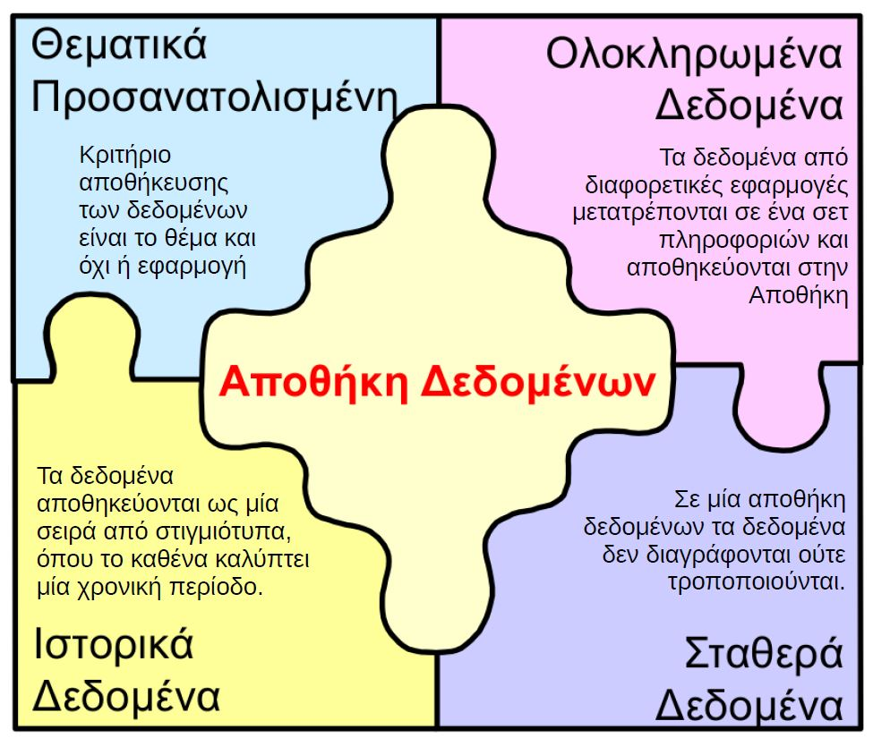
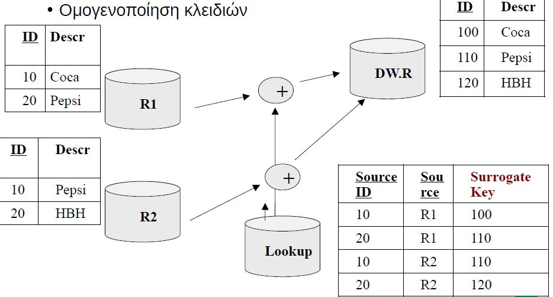
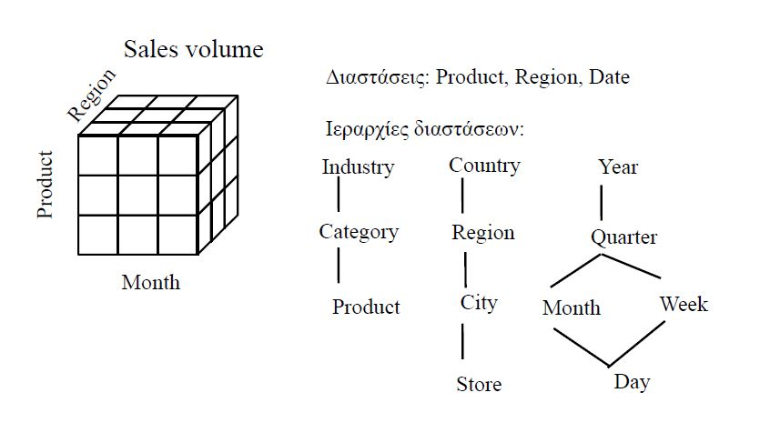
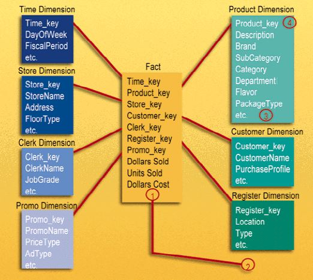
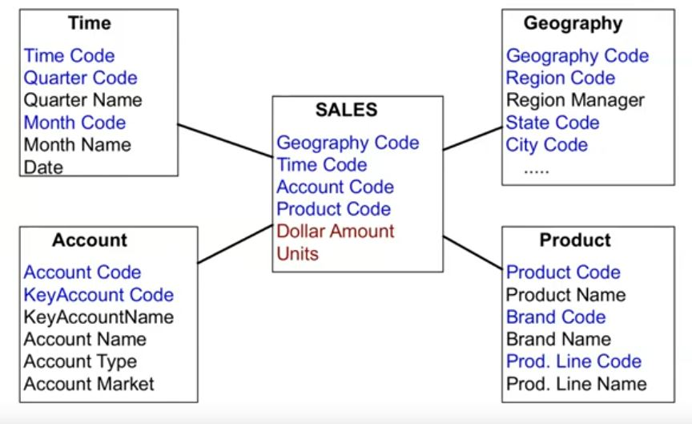
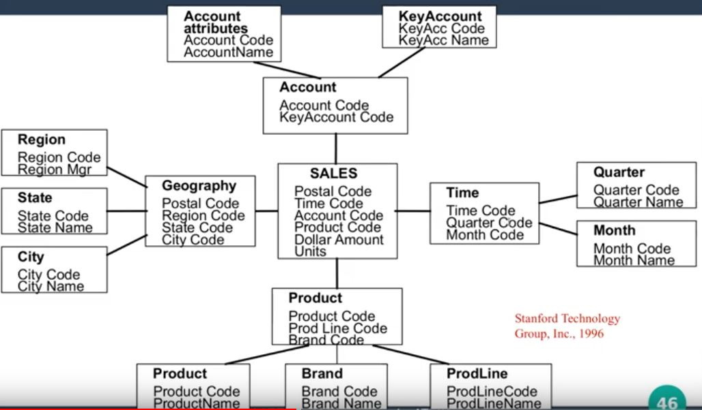

# Data Warehouses

> Μια συλλογή δεδομένων που επιλέγονται από τις Επιχειρησιακές Βάσεις, **ολοκληρώνονται** και στη συνέχεια τα συλλεγμένα δεδομένα αναλύονται με διαδικασιές όπως η OLAP ή την εξόρυξη δεδομένων

## Διαφορές ΑΔ και ΒΔ

| Χαρακτηριστικό | ΣΔΒΔ | Αποθήκη Δεδομένων |
| :-- | :-- | :-- |
| Σκοπός | Εκτέλεση καθημερινών διεργασιών | Υποστήριξη αποφάσεων |
| Λειτουργία | Διεκπεραίωση συναλλαγών | Εξαγωγή Πληροφορίας |
| Χρήστες | Κατώτεροι εργαζομένοι πχ ταμίες | Υψηλόβαθμα στελέχη, αναλυτές γνώσεις |
| Αριθμός Χρηστών | (μέχρι) χιλιάδες | (μέχρι) εκατοντάδες |
| Δεδομένα | Τρέχοντα, απομονωμένα | Ιστορικά, ολοκληρωμένα | 
| Μέγεθος | 100 ΜΒ - 100 GB | 100 GB - 10 TB |
| Σχεδιαζσμός | Κανονικοποίηση, ΔΟΣ | Μοντελοποίηση διαστάσεων, απο-κανονικοποίηση |
| Χρήση | Επαναληπτική | ad-hoc |
| Προσπέλαση | Ανάγνωση - Εγγραφή | (κυρίως) Ανάγνωση |
| Ενημέρωση | Συνεχής | Περιοδική |
| Μονάδα εργασίας | σύντομες, απλές συναλλαγές | Περίπλοκα ερωτήματα |
| Χρόνοι διεκπερέωσης | millisec - sec | λεπτά - ώρες |  
| Αριθμός προσπελασμένων εγγραφών | δεκάδες | εκατομμύρια |
| Μονάδα Απόδοσης | Συναλλαγές ανά δευτερόλεπτο | Χρόνος απόκρισης ερωτημάτων |
| ACID (lul) | Ναι | Όχι |
| Κατάλογοι | Β-δέντρα | Bitmap κατάλογοι |

## Αρχιτεκτονική 

**ETL (Extract-Transform-Load) εφαρμογές** - Εφαρμογές που εκτελούν διαδικασίες εξαγωγής, μεταφοράς, μετασχηματισμού, καθαρισμού και φόρτωσης δεδομένων από πηγές στην ΑΔ

**Εφαρμογές Ανάλυσης** - Εφαρμογές παραγωγήςε αναφορών, OLAP, Data Mining

## Ενημέρωση Αποθήκης Δεδομένων

- Η ενημέρωση της ΑΔ μεταφέρει τις αλλαγές που συμβαίνουν στα δεδομένα των πηγών εκτελώντας αντίστοιχες αλλαγές στα δεδομένα ΑΔ
- Ακολουθεί όλα τα βήματα
  1. Μεταφορά
  2. Μετασχηματισμός
  3. Καθαρισμός
  4. Εισαγωγή
- Η πολιτική ενημέρωσης καθορίζεται από το διαχειριστή της ΑΔ με βάση 
  - Τις ανάγκες των εφαρμογών ανάλυσης 
  - Διαθεσιμότητα πηγών 
  - Κατάσταση Δικτύου

## Εξαγωγή Δεδομένων

Στόχος: Εύρεση αλλαγών στις πηγές, νέες εγγραφές, διαγραφές και ενημερώσεις.

Τεχνικές: Εξαγωγή στιγμιοτύπωνή διαφορικά πηγαίων δεδομένων

Περιορισμοί: 
- Διαθέσιμο πεπερασμένο χρονικό παράθυρο
- Ελαχιστοποίηση λειτουργικής επιβάρυνσης OLTP συστημάτων
- Ελαχιστοποίηση αλλαγών στο software configuration των OLTP συστημάτων
- Πού/Πώς συγκρίνονται τα πλήρη στιγμιότυπα; Πηγές ή στην ΑΔ;
- Τεχνικές εντοπισμού αλλαγών
  - Log Files (Γρήγορο, Μπαμ Μπαμ)
  - Triggering (Σπάνιο)
  - Αλλαγές στα data entry προγραμμάτων (Επικίνδυνο)

## Μετασχηματισμός Δεδομένων

## Εννοιολογικό σχήμα της ΑΔ

- Χρήση του **μοντέλου Διαστάσεων** 

- **Διαστάσεις**: Παράμετροι που καθορίζουν το contect των μέτρων, π.χ. ημερομηνία, προϊόν, τοποθεσία, πωλητής, ... **διαφορετικά επίπεδα** λεπτομέρειας ανά διάσταση μέρα, μήνας, χρόνος, ...
- **Κύβοι**: συνδυασμοί διαστάσεων που καθορίζουν κάποια μέτρα.
- **Πίνακας Διάστασης (Dimension table)**: Ο πίνακας που περέχει πληροφορία σχετική **με μια διάσταση**. Περιέχει ένα τεχνητό κλειδί και από μια στήλη για κάθε επίπεδο της διάστασης
- **Πίνακας Δεδομένων (Fact table)**: Ο πίνακας που υλοποιεί τον υπό μοντελοποίηση κύβο
  - Κάθε εγγραφή αντιστοιχεί σε ένα κελί του κύβου
  - Για κάθε διάσταση, υπάρχει και ένα εξωτερικό κλειδί στον αντίστοιχο πίνακα και για κάθε μέτρο και μια αντίστοιχη στήλη
  - Το πρωτεύον κλειδί είναι ο συνδυασμός των κλειδιών των διαστάσεων (Συντεταγμένες κελιού)

### Κατηγορίες Σχημάτων ΑΔ: Star Schema - Snowflake Schema

#### Star Schema

- Οι πίνακες είναι σε **ΜΗ κανονικοποιημένη μορφή**
- Αναγκαίο σε OLAP για αποφυγή joins -> ταχύτητα

#### Snowflake Schema

- Οι πίνακες είναι σε **κανονικοποιημένη μορφή**
- Χρήση μόνο όταν η ΑΔ δεν είναι πολύ μεγάλη

### Πράξεις OLAP

#### Σύμπτυξη (Roll-up)
Συνάθροιση σε διαφορετικά επίπεδη μιας ιεραρχίας διαστάσεων. Παράγει κύβο με **μειωμένο επίπεδο λεπτομέρειας**. Κάνει δηλαδή zoom-out. Στην ουσία περιλαμβάνει **συνολικές τιμές** για μια **θέση στην ιεραρχία** μιας διάστασης δεδομένων.

Παράδειγμα: οι πωλήσεις σε επίπεδο τοπικό μαγαζί θέτονται σε πωλήσεις πόλεων.

#### Ανάπτυξη (Drill-Down)

Αντίθετο της σύμπτυξης. Παράγει κύβο δεδομένων με αυξημένο επίπεδο λεπτομέρειας. zoom-in.

#### Περιστροφή (Pivot)
Παραγωγή κύβου με **άλλη διάταξη** διαστάσεων. κανένας νέος υπολογισμός.