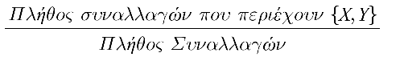
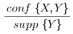
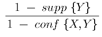
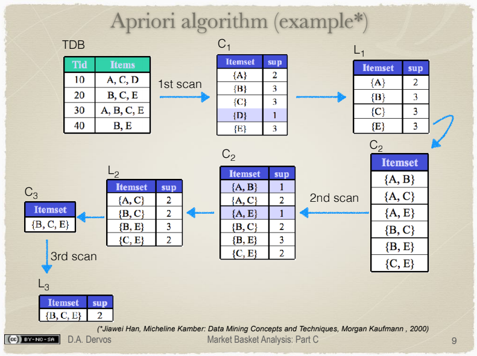
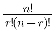
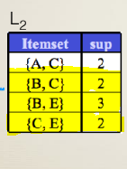

# Market Basket Analysis Cheatsheet

|         Ορολογία         |                                                                                                                                  Επεξήγηση                                                                                                                                  |                τύπος                |
| :----------------------: | :-------------------------------------------------------------------------------------------------------------------------------------------------------------------------------------------------------------------------------------------------------------------------: | :---------------------------------: |
|   Support (Υποστήριξη)   |                                                                                                         Πόσο συνά εφαρμόζεται ο κανόνας {Χ,Υ} στο σύνολο δεδομένων                                                                                                          |    |
| Confidence (Εμπιστοσύνη) |                                                                                              Πόσο συχνά εφαρμόζεται ο κανόνας στα αντικείμενα Υ σε συναλλαγές που περιέχουν Χ                                                                                               |  |
|           Lift           | Πόσο ισχυρός είναι ο κανόνας. Αν είναι **κοντά στη μονάδα**, τότε είναι αδύναμος **(θόρυβος)**, και τα δεδομένα είναι ανεξάρτητα. Αν είναι **πολύ μεγαλύτερο** από τη μονάδα, τότε είναι χρήσιμη πληροφορία και τα δεδομένα είναι εξαρτημένα. Ισχύει η συμμετρική ιδιότητα. |          |
|        Conviction        |                            Παρόμοια με το Lift. Σε αντίθεση με το Lift, δεν ισχύει η συμμετρική ιδότητα συνεπώς η αγορά ενός αγαθού Χ μπορεί να τείνει στην αγορά του Υ, αλλά δεν σημαίνει απαραίτητα πως η αγορά του Υ τείνει στην αγορά του Χ.                            |   |

 - Όταν ένα Υποσύνολο Α έχει μεγάλο support (εμφανίζεται συχνά), τότε το υποσύνολο Β το οποίο είναι υποσύνολο του Α (ανήκει στο Α), έχει επίσης μεγάλο support. Ισχύει και το **αντίθετο**.

<a href="http://citeseerx.ist.psu.edu/viewdoc/download?doi=10.1.1.150.6616&rep=rep1&type=pdf">Χρήσιμο paper επεξήγησης</a>

## Αλγόριθμος Apriori

1. Αναζητούμε τα στοιχεία με το μικρότερη συχνότητα και τα αφαιρούμε.
2. Προχωρούμε ελέγχοντας τη συχνότητα σε ζευγάρια. Αφαιρούμε αυτά με τη μικρότερη.

Τα υποσύνολα που παρουσιάζουν ενδιαφέρον είναι για αυτά που έχουν πλήθος (ύπο)υποσυνόλου για **n** συχνότητα υποσυνόλου και **r** πλήθος αντικειμένων:

 

Στο παράδειγμα έχουμε  
n=3, r=2  
=> 3! / 2!(3-2)! = ... = 3.  
Ισχύει, παρατηρώντας:  

**Περιττοί (Reduntant) Κανόνες**

Ένας περιττός κανόνας L1 έχει μικρότερο confidence από ένα υποσύνολο του L2. Συγκεκριμένα, για να θεωρηθεί ένας κανόνας L1 περιττός θα πρέπει:

1. conf(L1)<=conf(L2)
2. L2 υποσύνολο του L1