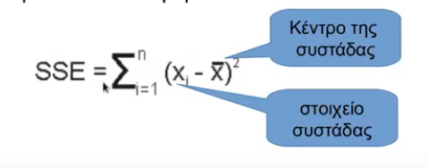

## Performance Metrics

**Accuracy | Ακρίβεια** = (TP+TN)/(TP+FP+FN+TN)

**Precision | Ορθότητα** = TP/(TP+FP)

**Recall | Ευαισθησία** = TP/(TP+FN)

**Specificity | Σαφήνεια** = TN/(TN+FP)

**FMeasure | FScore** = 2*(Recall * Precision) / (Recall + Precision)

## Data Reduction

### KNN

1. Δίνεται k παράμετρος.
2. Για κάθε δοθέν στοιχείο
   1. Συγκρίνω την κλάση του μαζί με την κλάση των **k** πλησιέστερων γειτώνων
   2. Αν είναι διαφορετικό, τότε το αφαιρώ

### CNN

1. Καμία παράμετρος.
2. Τοποθετώ ένα τυχαίο σημείο στο CS
3. Για κάθε δοθέν **TS** στοιχείο 
   1. Συγκρίνω την κλάση του μαζί με την κλάση του πλησιέστερου **CS** γείτωνα
   2. Αν είναι διαφορετικό, το αφαιρώ από το **TS** τοποθετώ στο **CS**
4. Επαναλαμβάνω το βήμα 3 μέχρι να μην υπάρξει καμία μετακίνηση

### IB2

> Σαν το CNN αλλά χωρίς το βήμα 4, δηλαδή **σταματάω στο πρώτο πέρασμα**.
## Data Abstraction

### CJA

1. Βρίσκω τα στοιχεία με τη μεγαλύτερη απόσταση
2. Αντιστοιχώ τα υπόλοιπα στοιχεία στα αρχικά, απόμακρα δημιουργώντας 2 ομάδες
3. Όσο ο αριθμός των ομάδων δεν είναι ίσος με το δοθέν **n**, κομματιάζω όσες ομάδες δεν είναι ομοιογενής, ξεκινώντας από τη μεγαλύτερη.
4. Για κάθε ομάδα, δημιουργώ ένα μέσο (απόσταση) αντικείμενο και το χαρακτηρίζω με βάση την πλειοψηφία

### RSP1

> Όπως και το CJA απλώς δημιουργώ μέσα στοιχεία ομάδας τόσα όσα και το πλήθος των διαφορετικών κλάσεων στην εκάστοτε ομάδα

1. Βρίσκω τα στοιχεία με τη μεγαλύτερη απόσταση
2. Αντιστοιχώ τα υπόλοιπα στοιχεία στα αρχικά, απόμακρα δημιουργώντας 2 ομάδες
3. Όσο ο αριθμός των ομάδων δεν είναι ίσος με το δοθέν **n**, κομματιάζω όσες ομάδες δεν είναι ομοιογενής, ξεκινώντας από τη μεγαλύτερη.
4. Για κάθε ομάδα
   - Δημιουργώ ομάδες τόσες όσες και το πλήθος των διαφορετικών κλάσεων
      - Για κάθε ομάδα, δημιουργώ ένα μέσο (απόσταση) αντικείμενο και το χαρακτηρίζω με βάση την πλειοψηφία

### RSP3

> Όπως και το RSP1 απλώς δεν έχω n: Συνεχίζω να σπάω μέχρι να όλες οι ομάδες να είναι ομοιογενής 

1. Βρίσκω τα στοιχεία με τη μεγαλύτερη απόσταση
2. Αντιστοιχώ τα υπόλοιπα στοιχεία στα αρχικά, απόμακρα δημιουργώντας 2 ομάδες
3. Κομματιάζω επαναληπτικά  όσες ομάδες δεν είναι ομοιογενής, ξεκινώντας από τη μεγαλύτερη.
4. Για κάθε ομάδα δημιουργώ ένα μέσο (απόσταση) αντικείμενο και το χαρακτηρίζω με βάση την πλειοψηφία

## Clustering

### K-Means

> Μας δίνεται ένα αρχείο δεδομένων με συντεταγμένες.
> Μας δίνονται 2 σημεία από το αρχείο ως αρχικά κέντρα.

1. Για κάθε σημείο από τα υπόλοιπα, τα αντιστοιχώ στο κοντινότερο κέντρο.
2. Μετά την αντιστοίχιση, Μετατοπίζω κάθε κέντρο υπολογίζοντας το μέσο σημείο ομάδας.
3. Ξανα αναθέτω τα κέντρα σε μη κεντρικά σημεία, επαναλαμβάνοντας τα βήματα 1,2 μέχρι να μην υπάρξει νέα μετατόπιση
   - Δημιουργώ στοιχεία όσα και το πλήθος των διαφορετικών κλάσεων
      - Κάθε στοιχείο είναι ένα μέσο (απόσταση) αντικείμενο και το χαρακτηρίζω με βάση την πλειοψηφία

### K-Median

> Ίδια φάση με k-means με μόνη διαφορά πως βρί σκουμε την ενδιάμεση τιμή, και όχι το μέσο όρο.

### Μέτρο SSE
>Θεωρούμε πως μια συστάδα είναι συμπαγής με βάση το μέγεθος του SSE. Είναι αντιστρόφως ανάλογη. (Μικρό μέγεθος SSE -> Αρκετά Συμπαγής)

