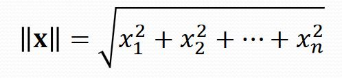
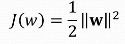

# Cheatsheet

## Στοιχεία

|             Σύμβολο             | Επεξήγηση        |
| :---------------------------: | :----------------- |
|      **C** \| Class                        | Κλάση     |
|      **x**                        | Πρότυπο            |
|      **w** \| weight       | βάρος                     |
| **t** \| target            | στόχος                    |
| **γ**            | απόσταση διαχωριστής ευθείας από το κοντινότερο πρότυπο κλάσης                    |

## Συναρτήσεις
|             Σύμβολο             | Επεξήγηση        |
| :---------------------------: | :-----------------: |
|     **\|\|x\|\|** Νόρμα                        |      |
|      **J(w)** Συνάρτηση κόστους                         |            | 
|      **argmax**{f(x)}                         | Υπολογισμός τιμών για μεταβλητές που μεγιστοποιούν το αποτέλεσμα μιας συνάρτησης           |

