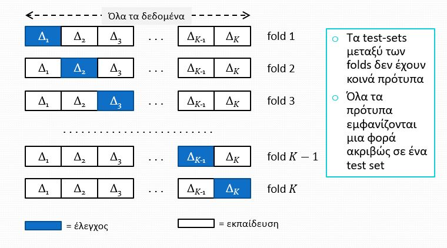
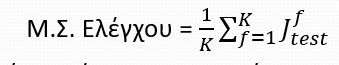
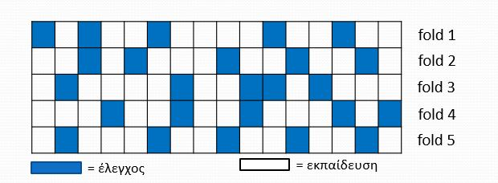
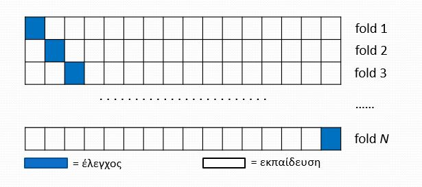

# Cross Validation

|  |  |
| :-- | :-- | 
| Μάθηση | Επίβλεψη |
| Διαθέσιμα Δεδομένα | Ν ζεύγη προτύπων [x,t] |
| Fold | Ένα πείραμα διαμοιρασμού δεδομένων σε Training\|Testing set και εκπαίδευση των πρώτων, ελέγχοντας την επίδοση της στο test set.
| Επαναλήψεις | Όσα και τα folds |
| Σφάλμα Εκπαίδευσης | Υπολογισμός για κάθε fold |
| Σφάλμα Ελέγχου | Υπολογισμός για κάθε fold |

## Εκτίμηση Επίδοσης

Χρήση Μέσου Σφάλματος Ελέγχου 

>Μπορούμε να υπολογίσουμε και το μέσο Σφάλ΄μα εκπαίδευσης αλλά δεν μας βοηθάει στη γενίκευση του μοντέλου οπότε συνήθως το αγνοούμε.

## Εκτίμηση ικανότητας πρόβλεψης άγνωστων δεδομένων και δημιουργία μοντέλου με μεγαλύτερη επίδοση γενίκευσης

**Στο Multi-Layer Perceptron**

1. Δοκιμή διάφορων υπερ-παραμέτρων, Έστω L(πλήθος στρωμάτων)=2,Ν(1)...,Ν(L-1) = πλήθος νευρώνων σε κάθε κρυφό στρώμα.

2. Για κάθε τιμή Ν(1) = Ν κάνουμε K-Fold Cross Validation και υπολογίζουμε το Μέσο Σφάλμα Ελέγχου Jtest(N). Επαναλαμβάνουμε για όλες τις τιμές Ν(1).
3. Επιλέγουμε τελικά την τιμή (Ν1)=Ν* με το μικρότερο Μέσο Σφάλμα Ελέγχου
4. Εκτιμάμε το σφάλμα σε άγνωσα δεδομένα του μοντέλου με Ν(1) = Ν* κρυφούς νευρώνες θα είναι Jtest(N*)
5. Εκπαιδεύουμε ξανά το μοντέλο με όλα τα πρότυπα χρησιμοποιώντας τη βέλτιστη ύπερ-παράμετρο Ν(1) = Ν*

## Γιατί Cross - Validation

- Ο διαμοιρασμός είναι απαραίτητος. 
  - Πρέπει να κρύψουμε κάποια δεδομένα κατά την εκπαίδευση για να μπορέσουμε να τα χρησιμοποιήσουμε για προβλέψεις

- Μάχη κατά τις υπέρ|υπό - μοντελοποίησης
  - Μπορούμε να δοκιμάσουμε για διαφόρες υπερπαραμέτρους μέχρι να βρούμε τη βέλτιστη συνάρτηση

## Βασικές Τεχνικές

| Random split | Leave Out One | 
| :--: | :--: | 
| | |
| Για κάθε fold τα πρότυπα ελέγχου επιλέγονται τυχαία | Σε κάθε fold αφήνουμε 1 ακριβώς πρότυπο για έλεγχο|
|  Αυθαίρετο πλήθος folds | Μειονέκτυμα : Υπάρχουν τόσα folds όσο τα πρότυπα, Τέλος αλγορίθμου πολύ  μετά το τέλος της υπομονής  μας|
| Κάποια πρότυπα χρησιμοποιούνται σε πολλά folds ως πρότυπα ελέγχου ενώ άλλα μπορεί να μην χρησιμοποιηθούν  καν (Τυχαία πρότυπα, δεν μας ενοχλέι, δεν υπάρχει προκατάληψη) | Πλεονέκτημα: Χρήση όσο το δυνατόν περισσότερα πρότυπα για εκπαίδευση|

## Πλεονεκτήματα  

1. Καλή εκτίμησητηςικανότητας γενίκευσης
2. Δυνατότητα εκτίμησης της βέλτιστης πολυπλοκότητας του μοντέλουγια μέγιστη γενίκευση
3. Μπορεί  να λετουργήσει με λίγα / πολλά  δεδομένα

##  Μεινεκτήματα

1. Υπολογιστικό κόστος. Πολλαπλή εκπαίδευση
2. Μέθοδος LOO: Ακραία περίπτωση