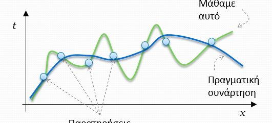
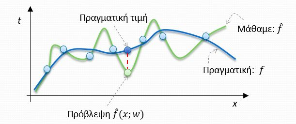
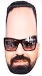
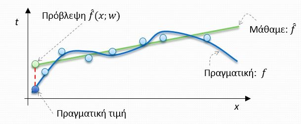
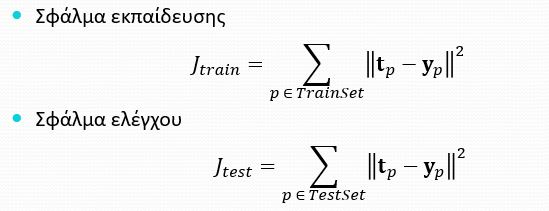

# Παλινδρόμηση (Regression) 

## Σφάλμα τύπου Α : Ύπερ-μοντελοποίηση (over-fitting)

- Το μοντέλο μας είναι πιο πολύπλοκο από την πραγματική συνάρτηση. Κακή γενίκευση.

- Η οικογένεια συναρτήσεων από όπου επιλέγουμε το τελικό μοντέλο f είναι **υπερβολικά πλούσια**. Η συνάρτηση μας ταιριάζει στα δεδομένα εκπαίδευσης αλλά δεν γενικεύει καλά επειδή υπάρχουν πολλές συναρτήσεις σαν κι αυτή.
- Παρατηρείται από τις οξείες γωνίες και τις έντονες κορυφές της καμπύλης.

## Σφάλμα τύπου Β :  Ύπο-μοντελοποίηση (under-fitting)

- Το μοντέλο είναι υπερβολικά απλό σε σχέση με την πραγματική συνάρτηση. Κακή γενίκευση.

- Η οικογένεια συναρτήσεων από όπου επιλέγουμε το τελικό μοντέλο f είναι **υπερβολικά φτωχή**. Για το λόγο αυτό δεν ταιριάζει στα δεδομένα εκπαίδευσης αλλά ούτε κάνει σωστή γενίκευση.

## Σφάλμα Εκπαίδευσης

>Σε ένα  πρόβλημα  ταξινόμησης το σφάλμα μπορείνα είναι  1 - Accuracy, όπου Accuracy = Σωστες Προβλέψεις / Στόχοι