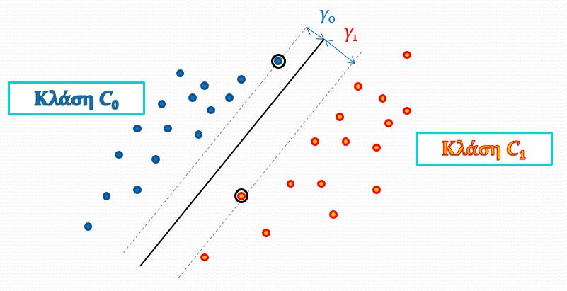
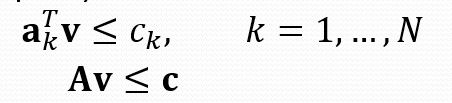

# Support Vector Machine

## Εισαγωγή

**Σκοπός** : Η μεγιστοποίηση περιθωρίου ανάμεσα από τα οριακά πρότυπα, έτσι ώστε σε επόμενη προσθήκη προτύπου, να **ελαχιστοποιείται η πιθανότητα** το πρότυπο αυτό να θεωρηθεί της απέναντι κλάσης.

Ψάχνουμε την ευθεία γραμμή που θα **χωρίζει βέλτιστα** τα πρότυπα σε κλάσεις αλλά και θα έχει το **μέγιστο δυνατό περιθώριο**.

### Περιθώριο ταξινόμησης

Περιθώριο : γ = min( γ0, γ1 )

|                 Στοιχείο                 |               Τύπος               |
| :--------------------------------------: | :-------------------------------: |
| Απόσταση από το διαχωριστικό υπερεπίπεδο |  |
|                Περιθώριο                 |    |

#### Μεγιστοποίηση Περιθωρίου ταξινόμησης

θέλουμε να βρούμε τις τιμές **w**, b.

> με το argmax εννοούμε πως ψάχνουμε τις τιμές **w**,b για τις οποίες η τιμή της συνάρτησης **μεγιστοποιείται.** 

 
 

Δύο Προσεγγίσεις

|                         Παρονομαστής = 1                          |                            Αριθμητής = 1                             |
| :----------------------------------------------------------------: | :------------------------------------------------------------------: |
|     Μεγιστοποίηση         |    Ελαχιστοποίηση         |
| Περιορισμός    | Περιορισμός    |
|                                                                    |                        Απλούστερη Προσέγγιση                         |

 
 

|                           Διανύσματα υποστήριξης                            |                                    Υπόλοιπα                                     |
| :-------------------------------------------------------------------------: | :-----------------------------------------------------------------------------: |
|                      γνωστά και ως **Οριακά πρότυπα**                       |                         γνωστά και ως **καλά πρότυπα**                          |
| Πρότυπα x για τα οποία ισχύει   | Πρότυπα x για τα οποία ισχύει:   |
|                         βρίσκονται πάνω στο margin                          |                           βρίσκονται πέρα από margin                            |
|                             |                                  |
|                                     λ>0                                     |                                       λ=0                                       |

 
 

## Λύση 1 : Τετραγωνικός Προγραμματισμός (Primal)

### Με λίγα λόγια
Σκοπός:

|        Ελάχιστο Συνάρτησης         |                Περιορισμοί                |
| :--------------------------------: | :---------------------------------------: |
|  |  |

Στη δική μας περίπτωση,Θέτουμε:  

 
 

## Λύση 2 : Δυικό Πρόβλημα (Dual)

Υπολογίζουμε τα βάρη **w** με βάση:  

όπου στην ουσία ψάχνουμε το **λ** το οποίο βρίσκεται από τον τύπο 

 
 

| Σύμβολο |                                Επεξήγηση                                |
| :-----: | :---------------------------------------------------------------------: |
|    Q    | Εσωτερικό γινόμενο διανυσμάτων   |
|    g    |                        Διάνυσμα με τιμές **-1**                         |
|    λ    |                           Lagrange Multiplier                           |

 
 
 

### Πόλωση

|                                                                                                                  |                                       |
| :--------------------------------------------------------------------------------------------------------------: | :-----------------------------------: |
|                                          Για τη βέλτιστη πόλωση ισχύει:                                          |  |
| Αλλά, για λόγους αριθμητικής ακρίβειας ισχύει όπου έχουμε το **μέσο όρο** για όλα τα **διανύσματα υποστήριξης**. |     |

### Μη γραμμικά διαχωρίσιμα προβλήματα

Εισαγωγή σε κάθε πρότυπο μια μεταβλητή χαραλότητας **ξ** (slack variable)

και ισχυέι ότι το άθροισμα των ξ > πλήθος λάθος ταξινομημένων προτύπων

Το ξ πρακτικά μας δείχνει **πόσο** το πρότυπο έχει **παραβιάσει το margin**.

#### Θέση του ξ

#### Νέα συνάρτηση Κόστους

όπου η C είναι μια σταθερά κόστους για την οποία ισχύει:  
Όσο μικρότερη, τόσο αγνοώ τις μεταβλητές χαλαρότητας, άρα το σύστημα δεν πιέζεται για τη βελτιστοποίηση της ταξινόμησης.

Και σκοπός είναι να ικανοποιούνται οι ανισότητες :  

#### Τιμές του λ

- Αν x κάτω από το margin τότε C=λ (κακό πρότυπο)
- Αν x πάνω στο margin τότε C>λ>0 (οριακό πρότυπο)
- Αν x πάνω από margin τότε λ=0 (καλό πρότυπο)

### Δυικό πρόβλημα vs Νέο Δυικό Πρόβλημα

|                                                     Δυικό                                                     |                                                   Νέο Δυικό                                                   |
| :-----------------------------------------------------------------------------------------------------------: | :-----------------------------------------------------------------------------------------------------------: |
|   καλό πρότυπο (κοινό)       |   καλό πρότυπο (κοινό)       |
|     οριακό πρότυπο (κοινό)       |     οριακό πρότυπο (κοινό)       |
|                                                       -                                                       |                           κακό πρότυπο                               |
| βέλτιστο διάνυσμα (κοινό)   | βέλτιστο διάνυσμα (κοινό)   |
|      βέλτιστη πόλωση (κοινό)        |     βέλτιστη πόλωση  (κοινό)        |
|   Ελάχιστο συνάρτησης (κοινό)      |  Ελάχιστο συνάρτησης  (κοινό)      |
|      Τιμή του λ !!!         |    Τιμή του λ !!!       |