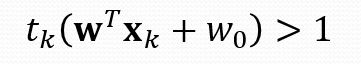
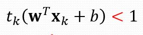

# Support Vector Machine

|                         Διανύσματα υποστήριξης                         |                                  Υπόλοιπα                                  |
| :--------------------------------------------------------------------: | :------------------------------------------------------------------------: |
|                    γνωστά και ως **Οριακά πρότυπα**                    |                       γνωστά και ως **καλά πρότυπα**                       |
| Πρότυπα x για τα οποία ισχύει   | Πρότυπα x για τα οποία ισχύει:   |
|                       βρίσκονται πάνω στο margin                       |                         βρίσκονται πέρα από margin                         |
|                        |                             |
|                                  λ>0                                   |                                    λ=0                                     |

 
 

## Δυικό Πρόβλημα

Υπολογίζουμε τα βάρη **w** με βάση:  

όπου στην ουσία ψάχνουμε το **λ** το οποίο βρίσκεται από τον τύπο 

 
 

| Σύμβολο |                            Επεξήγηση                            |
| :-----: | :-------------------------------------------------------------: |
|    Q    | Εσωτερικό γινόμενο διανυσμάτων   |
|    g    |                    Διάνυσμα με τιμές **-1**                     |
|    λ    |                       Lagrange Multiplier                       |

 
 
 

### Πόλωση

|                                                                                                                  |                                       |
| :--------------------------------------------------------------------------------------------------------------: | :-----------------------------------: |
|                                          Για τη βέλτιστη πόλωση ισχύει:                                          |  |
| Αλλά, για λόγους αριθμητικής ακρίβειας ισχύει όπου έχουμε το **μέσο όρο** για όλα τα **διανύσματα υποστήριξης**. |     |

### Μη γραμμικά διαχωρίσιμα προβλήματα

Εισαγωγή σε κάθε πρότυπο μια μεταβλητή χαραλότητας **ξ** (slack variable)

και ισχυέι ότι το άθροισμα των ξ > πλήθος λάθος ταξινομημένων προτύπων

Το ξ πρακτικά μας δείχνει **πόσο** το πρότυπο έχει **παραβιάσει το margin**.

#### Θέση του ξ

#### Νέα συνάρτηση Κόστους

όπου η C είναι μια σταθερά κόστους για την οποία ισχύει:  
Όσο μικρότερη, τόσο αγνοώ τις μεταβλητές χαλαρότητας, άρα το σύστημα δεν πιέζεται για τη βελτιστοποίηση της ταξινόμησης.

Και σκοπός είναι να ικανοποιούνται οι ανισότητες :  

#### Τιμές του λ

- Αν x κάτω από το margin τότε C=λ (κακό πρότυπο)
- Αν x πάνω στο margin τότε C>λ>0 (οριακό πρότυπο)
- Αν x πάνω από margin τότε λ=0 (καλό πρότυπο)

### Δυικό πρόβλημα vs Νέο Δυικό Πρόβλημα

|                                                     Δυικό                                                     |                                                Νέο Δυικό                                                 |
| :-----------------------------------------------------------------------------------------------------------: | :------------------------------------------------------------------------------------------------------: |
|   καλό πρότυπο (κοινό)       | καλό πρότυπο (κοινό)    |
|     οριακό πρότυπο (κοινό)       |  οριακό πρότυπο (κοινό)     |
|                                                       -                                                       |                            κακό πρότυπο                               |
| βέλτιστο διάνυσμα (κοινό)   | βέλτιστο διάνυσμα (κοινό)   |
|      βέλτιστη πόλωση (κοινό)        |  βέλτιστη πόλωση  (κοινό)      |
|      Ελάχιστο συνάρτησης (κοινό)        |  Ελάχιστο συνάρτησης  (κοινό)      |
|      Τιμή του λ !!!         | Τιμή του λ !!!     |