# Support Vector Machine

## Εισαγωγή

- Απαιτούν σαν είσοδο διανύσματα **x** μαζί με τους στόχους t.
- **Μάθηση με επίβλεψη**
- Βάση στον **τετραγωνικό προγραμματισμό.**
- **Ρηχό μοντέλο μάθησης** γιατί περιέχει μόνο 2 στρώματα υπολογιστικών μονάδων
  
 

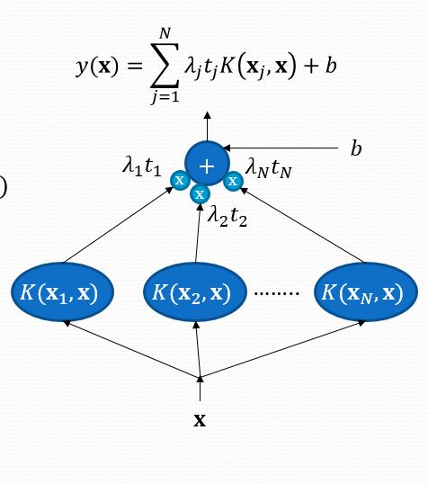

  
 
 
 
 

**Σκοπός** : Η μεγιστοποίηση περιθωρίου ανάμεσα από τα οριακά πρότυπα, έτσι ώστε σε επόμενη προσθήκη προτύπου, να **ελαχιστοποιείται η πιθανότητα** το πρότυπο αυτό να θεωρηθεί της απέναντι κλάσης.

Ψάχνουμε την ευθεία γραμμή που θα **χωρίζει βέλτιστα** τα πρότυπα σε κλάσεις αλλά και θα έχει το **μέγιστο δυνατό περιθώριο**.

### Περιθώριο ταξινόμησης

Περιθώριο : γ = min( γ0, γ1 )

|                 Στοιχείο                 |               Τύπος               |
| :--------------------------------------: | :-------------------------------: |
| Απόσταση από το διαχωριστικό υπερεπίπεδο | 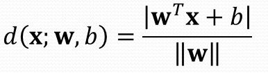 |
|                Περιθώριο                 |  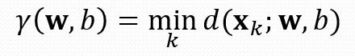  |

#### Μεγιστοποίηση Περιθωρίου ταξινόμησης

θέλουμε να βρούμε τις τιμές **w**, b.

> με το argmax εννοούμε πως ψάχνουμε τις τιμές **w**,b για τις οποίες η τιμή της συνάρτησης **μεγιστοποιείται.** 

 
 

Δύο Προσεγγίσεις

|                          Παρονομαστής = 1                          |                            Αριθμητής = 1                             |
| :----------------------------------------------------------------: | :------------------------------------------------------------------: |
|     Μεγιστοποίηση   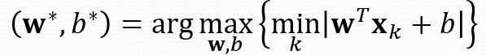      |    Ελαχιστοποίηση         |
| Περιορισμός    | Περιορισμός    |
|                                                                    |                        Απλούστερη Προσέγγιση                         |

 
 

|                           Διανύσματα υποστήριξης                            |                                    Υπόλοιπα                                     |
| :-------------------------------------------------------------------------: | :-----------------------------------------------------------------------------: |
|                      γνωστά και ως **Οριακά πρότυπα**                       |                         γνωστά και ως **καλά πρότυπα**                          |
| Πρότυπα x για τα οποία ισχύει   | Πρότυπα x για τα οποία ισχύει:   |
|                         βρίσκονται πάνω στο margin                          |                           βρίσκονται πέρα από margin                            |
|              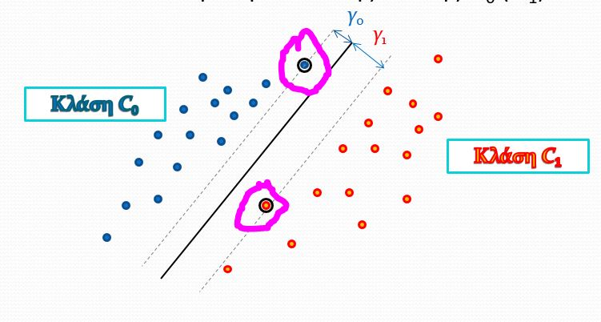               |                 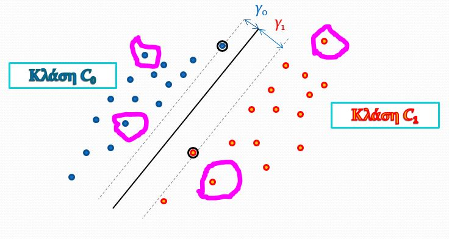                 |
|                                     λ>0                                     |                                       λ=0                                       |

 
 

## Λύση 1 : Τετραγωνικός Προγραμματισμός (Primal)

### Με λίγα λόγια
Σκοπός:

|        Ελάχιστο Συνάρτησης         |                Περιορισμοί                |
| :--------------------------------: | :---------------------------------------: |
| 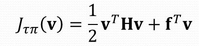 |  |

Στη δική μας περίπτωση,Θέτουμε:  
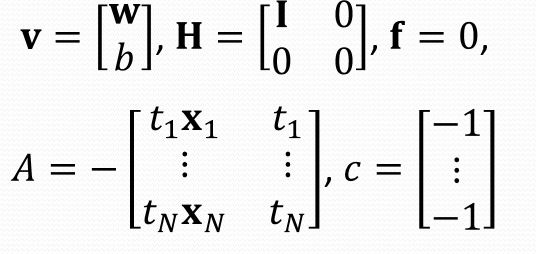

 
 

## Λύση 2 : Δυικό Πρόβλημα (Dual)

Υπολογίζουμε τα βάρη **w** με βάση:  

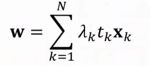

όπου στην ουσία ψάχνουμε το **λ** το οποίο βρίσκεται από τον τύπο 

 
 

| Σύμβολο |                                Επεξήγηση                                |
| :-----: | :---------------------------------------------------------------------: |
|    Q    | Εσωτερικό γινόμενο διανυσμάτων   |
|    g    |                        Διάνυσμα με τιμές **-1**                         |
|    λ    |                           Lagrange Multiplier                           |

 
 
 

### Πόλωση

|                                                                                                                  |                                       |
| :--------------------------------------------------------------------------------------------------------------: | :-----------------------------------: |
|                                          Για τη βέλτιστη πόλωση ισχύει:                                          | 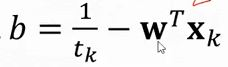 |
| Αλλά, για λόγους αριθμητικής ακρίβειας ισχύει όπου έχουμε το **μέσο όρο** για όλα τα **διανύσματα υποστήριξης**. |  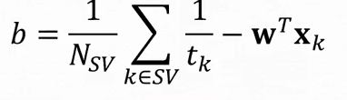   |

### Μη γραμμικά διαχωρίσιμα προβλήματα

Εισαγωγή σε κάθε πρότυπο μια μεταβλητή χαραλότητας **ξ** (slack variable)

και ισχυέι ότι το άθροισμα των ξ > πλήθος λάθος ταξινομημένων προτύπων

Το ξ πρακτικά μας δείχνει **πόσο** το πρότυπο έχει **παραβιάσει το margin**.

#### Θέση του ξ

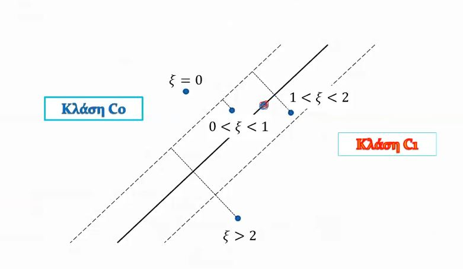

#### Νέα συνάρτηση Κόστους

όπου η C είναι μια σταθερά κόστους για την οποία ισχύει:  
Όσο μικρότερη, τόσο αγνοώ τις μεταβλητές χαλαρότητας, άρα το σύστημα δεν πιέζεται για τη βελτιστοποίηση της ταξινόμησης.

Και σκοπός είναι να ικανοποιούνται οι ανισότητες :  

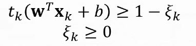

#### Τιμές του λ

- Αν x κάτω από το margin τότε C=λ (κακό πρότυπο)
- Αν x πάνω στο margin τότε C>λ>0 (οριακό πρότυπο)
- Αν x πάνω από margin τότε λ=0 (καλό πρότυπο)

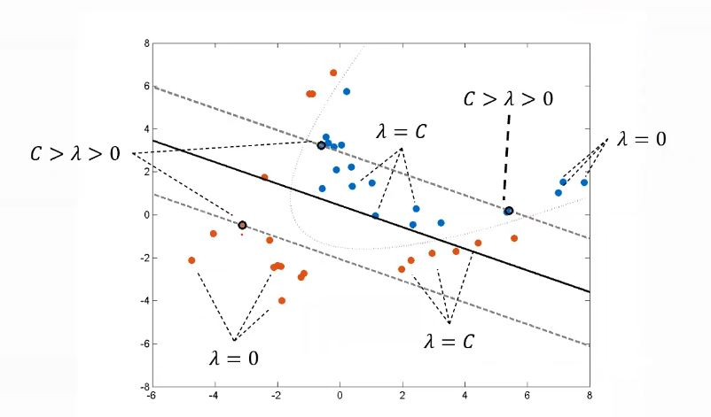

### Δυικό πρόβλημα vs Νέο Δυικό Πρόβλημα

|                                                     Δυικό                                                     |                                                   Νέο Δυικό                                                   |
| :-----------------------------------------------------------------------------------------------------------: | :-----------------------------------------------------------------------------------------------------------: |
|   καλό πρότυπο (κοινό)       |   καλό πρότυπο (κοινό)       |
|     οριακό πρότυπο (κοινό)       |     οριακό πρότυπο (κοινό)       |
|                                                       -                                                       |                           κακό πρότυπο                               |
| βέλτιστο διάνυσμα (κοινό)   | βέλτιστο διάνυσμα (κοινό)   |
|      βέλτιστη πόλωση (κοινό)        |     βέλτιστη πόλωση  (κοινό)        |
|   Ελάχιστο συνάρτησης (κοινό)      |  Ελάχιστο συνάρτησης  (κοινό)      |
|      Τιμή του λ !!!         |    Τιμή του λ !!!   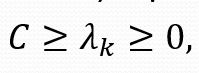    |

## Primal ή Dual;

Και τα δύο είναι ισοδύναμα.  
Ο στόχος του προβλήματος είναι η εύρεση **w**,b.  

Επιλέγουμε,  

**Dual** : όταν η διάσταση του **w** είναι **μικρότερη** από το πλήθος των προτύπων Ν . 

**Primal** : όταν η διάσταση του **w** είναι **μεγαλύτερη** από το πλήθος των προτύπων Ν.

## Διαχωρισμός μη Γραμμικών Κλάσεων

### Μετασχηματισμός του προβλήματος σε άλλο χώρο

|             Υπολογισμός κόστους             |
| :-----------------------------------------: |
|  |

Μετατροπές : 

|  Μετατροπή  |                  Εικόνα                  |
| :---------: | :--------------------------------------: |
|   Πρότυπα   |       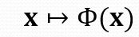       |
| Περιορισμοί | 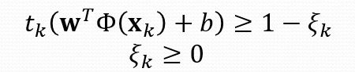 |

### Συναρτήσεις Kernel

Ακόμη και σε περιπτώσεις περισσότερων διαστάσεων, έστω 1000, δεν έχουμε πρόβλημα με τα **w**, γιατί δεν χρειάζεται να υπολογίσουμε ούτε τα **w** ούτε το Φ(x).

Το μόνο που χρειάζεται να υπολογίσουμε είναι ο lagrange multiplier.

#### Τύπος

Ορίζουμε την συνάρτηση kernel όπου: 

η οποία επιστρέφει **αριθμό**.

#### Kernel Δυικό Πρόβλημα

|          Στοιχείο           |                      Επεξήγηση                      |
| :-------------------------: | :-------------------------------------------------: |
| Ελάχιστο συνάρτησης κόστους |                 |
|         Περιορισμοί         |  |
|         Παρατήρηση          |          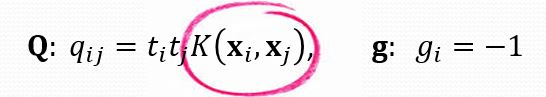          |

>Δεν χρειάζεται να γνωρίζουμε τη συνάρτηση Φ() για να υπολογίσουμε τα Q,g. Χρειαζόαμστε μόνο την Κ().
> - Κάθε συνα΄ρτηση Φ() παράγει έναν πυρήνα.
> - Μερικές φορές, η συνα΄ρτηση Φ() έχει άπειρε διαστάσεις.

##### Kernel Trick

1. Επιλογή συνάρτηση πυρήνα K(**a,b**) που να παράγεται από κάποια συνα΄ρτηση Φ ως Κ(**a,b**) = Φ(**a**)Φ(**b**)
    - Δεν μας νοιάζει ποια είνια η Φ(), αρκεί να ξέρουμε ότι υπάρχει.
    - Δεν είναι όλες οι συναρτήσεις Κ() πυρηνικές. Πρέπει να ικανοποιούν τις προύποθέσεις του θεωρήματος <a href="ikee.lib.auth.gr/record/131347/files/bouzas.pdf#page=43" target="_blank" >Mercer.</a>
2. Υπολογίζουμε το **Q** στο δυϊκό πρόβλημα χρησιμοποιώντας την Κ.
3. Λύνουμε το Δυϊκό.

#### Συνηθισμένοι Πυρήνες

#### Λύση

Σύμφωνα με όσα έχουμε πει, τα βέλτιστα **w**,b είναι 

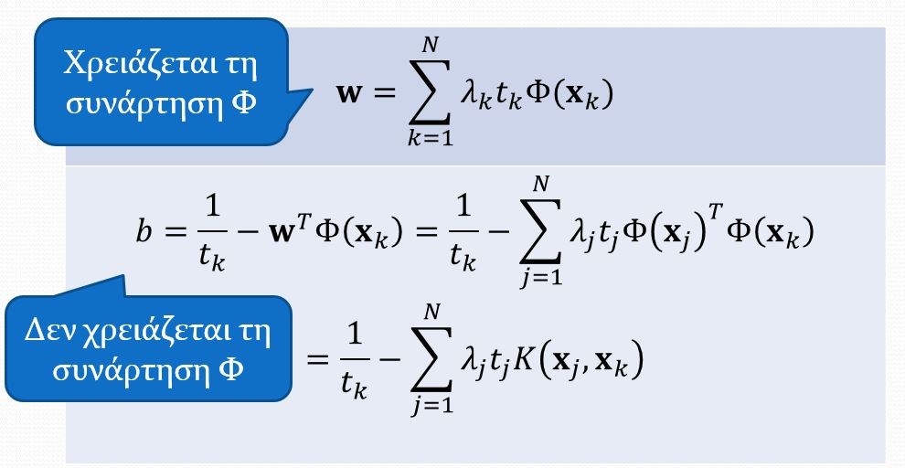

Ισχύει:

- Αν θέλουμε το **w** είναι απαραίτητη η Φ...
- ΑΛΛΑ, δεν δίνουμε δεκάρα για το **w**!
- Αυτό που μας νοιάζει είναι η έξοδος του ταξινομητή: 

### Παραδείγματα Πυρήνων

Όσο μεγαλύτερο το σ, τόσο μεγαλύτερες οι καμπάνες / εμβέλεια που καλύπτουν τα πρότυπα, άρα μεγαλύτερη έκταση της κλάσης.

### Πλεονεκτήματα και ανοικτά θέματα

| Πλεονεκτήματα                          | Προβληματάκια                                                                                                                                          |
| :------------------------------------- | :----------------------------------------------------------------------------------------------------------------------------------------------------- |
| Λύση γραμμικών & Γραμμικών προβλημάτων | Άγνωστη βέλτιστη επιλογή πυρήνα. Χρειάζονται δοκιμές                                                                                                   |
| Πολύ υψηλή επίδοση                     | Προβλήματα μεγάλου μεγέθους (Big data). Όσο περισσότερα τα πρότυπα Ν, τόσο περισσότερες οι πράξεις στον υπολογισμό του πίνακα **Q** όπου ισχύει Ν * Ν. |
| Βέλτιστο περιθώριο -> Καλή γενίκευση.  | Άγνωστος τρόπος παραλληλοποίησης αλγορίθμου                                                                                                            |
|                                        | Ρηχό μοντέλο μάθησης                                                                                                                                   |

### Σημειώσεις

- Όσο μεγαλώνει το γ, τόσο βελτιώνεται και το σφάλμα στο TR set.
- Μετά από ένα σημείο, όσο μεγλώνει το γ, το σφάλμα χειροτερεύει.
- τα γ και C λέγονται ***ύπερ παράμετροι***. Δίνονται από το **χρήστη** και **δεν εκπαιδεύονται** από το μοντέλο.
- Οι γ και C επιλέγονται με τη μέθοδο της δοκιμής και σφάλματος.  