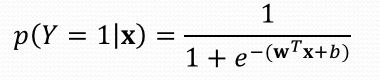
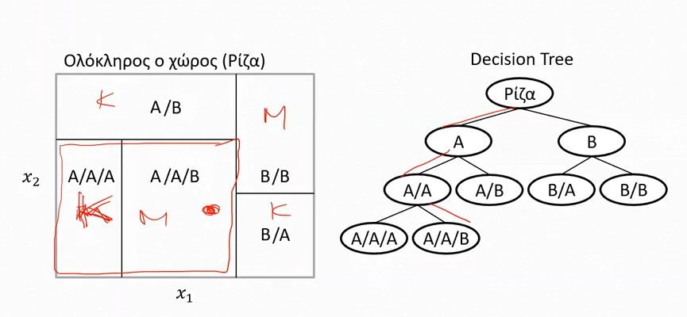

# Sigmoid & Softmax  

## Sigmoid

- Υπολογισμός πιθανότητας (βάση ο bayes)  

 Σιγμοειδής συνάρτηση - Logistic Sigmoid 

 ## Softmax
 - Βγάζει ευθείες (Γραμμικό μοντέλο)
 - Multiclass 
 - Πιθανότητες ως έξοδοι
 - Χρήση φόρμουλας sigmoid

## Κ-ΝΝ

Η κατηγοριοποίηση γίνεται με βάση τους κοντινότερους γείτονες.
- Συνήθως βάση ευκλείδιας απόστασης
- Υπερπαράμετροι: Αριθμός πλησιέστερων γειτόνων **(k)**
- Lazy algorithm, χωρίς αυτορρύθμιση
- Μικρό k: Overfitting, μικρές απομονωμένες περιοχές
- Μεγάλο k: Underfitting, πρόβλημα όταν μια κλάση έχει ελάχιστα πρότυπα
- Εξαιρετικό υπολογιστικό κόστος

## Δένδρα Αποφάσεων

- Συνεχής διαχωρισμός χώρου
- Υπερπαράμετροι
  - Κριτήριο
  - Βάθος
  - Τερματισμός
    - Καθαρότητα
    - Δείγματα

### Εύρεση κατωφλιού τεμαχισμού

- Κριτήριο: μη - Καθαρότητα
- Μέθοδος εύρεσης: Εντροπία ή Gini
- Για κάθε χαρακτηριστικό, τεμαχίζω ως προς αυτό, και για κάθε περιοχή που δημιουργείται, μετρώ την τιμή Gini και επιλέγω το χαρακτηριστικό με την μικρότερη τιμή, διότι έτσι έχουμε τη μεγαλύτερη καθαρότητα