# Επιλογή Χαρακτηριστικών & Συμπίεση

**Αποφεύγω** να έχω άχρηστα δεδομένα στο **x** γιατί:
1. Υπολογιστικό κόστος
2. Πιθανότητα τοπικών ελαχίστων
3. Πολύπλοκο μόντελο, άρα ύπερ-μοντελοποίηση.

## Συμπίεση

Η μείωση χαρακτηριστκών προτύπου με σκοπό την αποφυγή των παραπάνω, με την ελάχιστη δυνατή μείωση στην πληροφορία.

## Παράδειγμα 

>- Έστω διάνυμα χαρακτηριστικών **x** με n στοιχεία
>- Θέλουμε να βρούμε m συνδυασμούς των χαρακτηριστικών που να περιγράφουν τα δεδομένα εξίσου καλά όπως και τα αρχικά χαρακτηριστικά **x** αλλά να έχουμε m < n
>- Πόσο μικρότερο m μπορούμε να έχουμε σε σχέση με το n;

Επιλογή χαρακτηριστικών
|    Τεχνική     |                   Επεξήγηση                    |                      Εικόνα                       |
| :------------: | :--------------------------------------------: | :-----------------------------------------------: |
| Χωρίς επίβλεψη | Επιλογή χωρίς να γνωρίζουμε τις τιμές στόχων t | 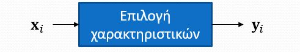 |
|  Με επίβλεψη   |   Επιλογή **γνωρίζοντας** τις τιμές στόχων t   |  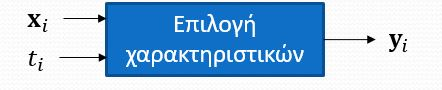   |

Το τελικό πλάνο είναι να φιλτράρουμε τα χαρακτηριστικά και να χρησιμοποιήσουμε τα πιο ζουμερά στην απόφαση.

## Καλά χαρακτηριστικά

Πως ξεχωρίζουμε ένα καλό χαρακτηριστικό από ένα κακό;

Χρησιμοποιούμε τον τύπο της  συσχέτισης (**correlation**)

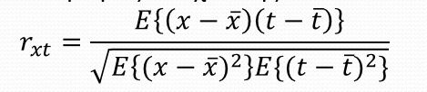

Θεωρούμε καλά χαρακτηριστικά αυτά που έχουν r > κάποιο θ

### Έννοια της πληροφορίας

Έστω τυχαία μεταβλητή (χαρακτηριστικό ) Χ που παίρνει τιμές {χ1,...,χn} με πιθανότητες pi = Prob(X=xi)

Ψάχνουμε να βρούμε πόσα bits χρειαζόμαστε κατά μέσο όρο ανά σύμβολο X(i)

Η απάντηση είναι 

**Σ( Μήκος Πληροφορίας * Πιθανότητα Πληροφορίας )**

### Θεώρημα Πληροφορίας Shannon

Το μέσο μήκος κώδικα που απαιτείτα για να κωδικοποιηθεί μια τυχαία μεταβλητή Χ ώστε ο παραλήπτης να μπορεί να ανακατασκευάσει την ακολουθία χωρίς κανέναν λάθος είναι **τουλάχιστον** 
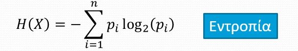

### Εντροπία

Επίσης γνωστή ως **Εσωτερική Πληροφορία**. Είναι ένα μέτρο αβεβαιότητας = ποσότητα πληροφορίας που πρέπει να στείλουμε ή να αποθηκεύσουμε ώστε να ταυτοποιήσουμε κάθε δείγμα με μοναδικό τροπό.

### Δεσμευμένη Εντροπία 
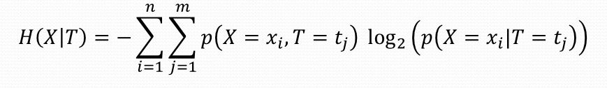

Και ισχύει ότι H(X|T) <= H(X)

Η ισότητα ισχύει αν-ν τα Χ,Τ είναι ανεξάρτητα.

 H(X|T) = H(X) <=> X,T : ανεξάρτητα, δηλαδή το χαρακτηριστικό είναι κακό.

### Αμοιβαία πληροφορία

**Ορισμός**  
Η διαφορά μεταξύ εντροπίας και δεσμευμένης εντροπία 

**I(X,Y) = H(X) - H(X|T)**

- Επειδή H(X|T) <= H(X), η αμοιβαία πληροφορία είναι **πάντα** θετική ( δεν μπορούμε να χάσουμε πληροφορία, lul)

- Ισχύει η συμμετρία : I(X,T) = I(T,X)

### Test Kolmogorov - Smirnov (Άεντα)

Έστω δύο ακολουθίες δειγμάτων **x** (πλήθος N) και **y** (πλήθος M).  
Υπολογίζει την πιθανότητα οι δύο ακολουθίες να προέρχονται από δείγματα ίδιας κατανομής.

Αθροιστικές κατανομές
- Fx(x) = 1/N * count(xi< x κατώφλι)
- Fy(y) = 1/M * count(yi< y κατώφλι)

Μετράμε την απόσταση μεταξύ των παραπάνω : d = max | Fx(z) - Fy(z) | 

- **Επίπεδο σημαντικότητας (Significance Level)** του KS

    - α = Prob (Θεωρώ πως υπάρχει διαφορά | είναι ίδια) = Prob (d>θ|same)

- **Ισχύς (Power)** του KS

    - β = Prob (Θεωρώ πως υπάρχει διαφορά | Υπάρχει διαφορά ) = (d>θ | διαφορετικά)

Το βέλτιστο κατώφλι είναι : 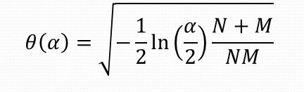

#### KS p-value

- Έστω ότι η απόσταση d ένα δείγμα από μια τυχαία μεταβλητή D
- p-value = η πιθανότητα ότι το D θα είναι μεγαλύτερο από d δεδομένου ότι οι  δύο κατανομές είναι ίδιες

p = Prob(D => d | same)

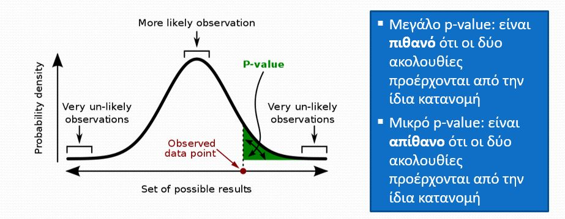

#### Εφαρμογή

Θεωρούμε πρόβλημα ταξινόμησης σε δύο κλάσεις με t (0,1)

1. Για το χαρακτηριστικό Χπάρε δύο υποσύνολα
   - Υποσύνολο Χ όταν t = 0 
   - Υποσύνολο Χ όταν t = 1
2. Φίξαρε την τιμή του level πχ α = 10^-3
3. τρέξε το τεστ KS και υπολόγισε το p-value  
   
- Μεγάλο p-value σημαίνει ότι οι δύο ακολουθίες προέρχονται από την ίδια κατανομή άρα **Χ άχρηστο**

- μικρό p-value σημαίνει ότι οι δύο ακολουθίες προέρχονται από διαφορετιές κατανομές άρα **Χ καλό**

### Στατιστικές παρατηρήσεις

- Αν κάποια χαρακτηριστικά δεν έχουν **διακύμανση** τότε δεν φέρουν χρήσιμη πληροφορία 
- Η **μεγαλή διακύμανση δεν σημαίνει** απαραίτητα πως ένα χαρακτηριστικό είναι χρήσιμο
  - 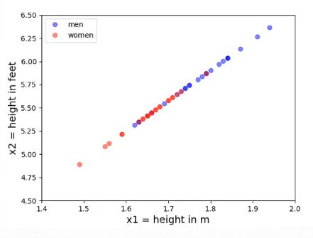Στην περίπτωση αυτή, μπορούμε να στρέψουμε την ευθεία για να καταλάβουμε ότι το χαρακτηριστικό είναι άχρηστο

|            Εξαρτημένα             |               Ανεξάρτητα                |
| :-------------------------------: | :-------------------------------------: |
| 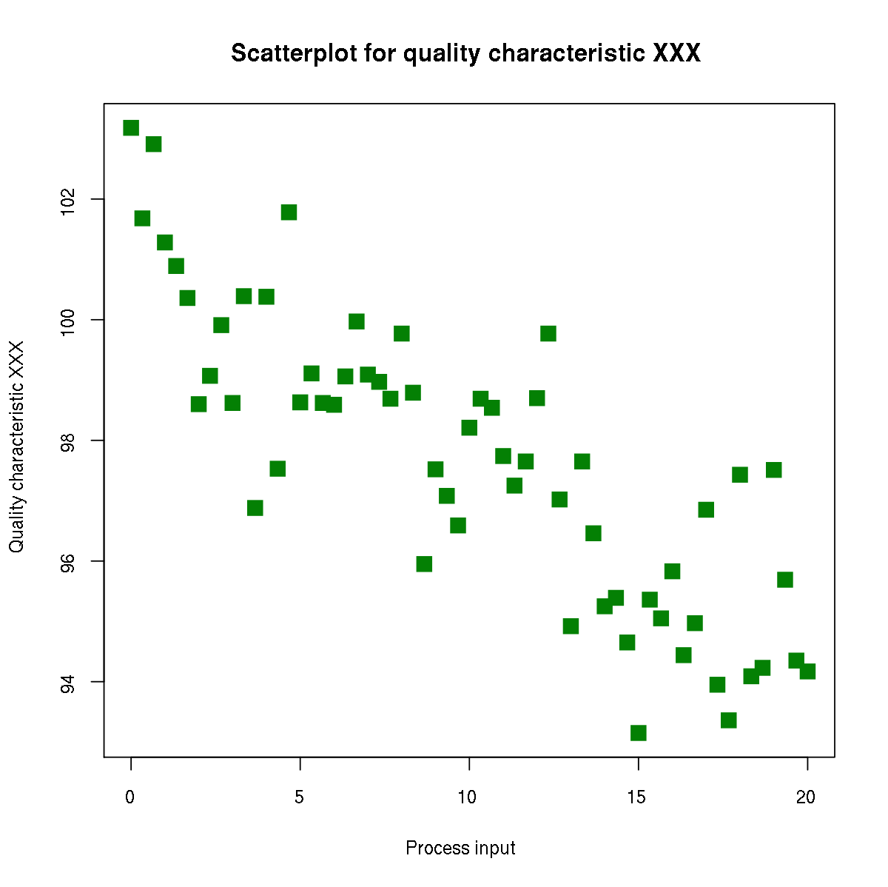 |  |
|      Περιορισμός σε υποχώρο       |             Άπλωση στο χώρο             |

### Κρυφοί Παράγοντες
Τα δεδομένα που δημιουργούνται επηρεάζονται και από **κρυφούς παράγοντες**, τους οποίους δεν μπορούμε τυπικά να τους ερμηνεύσουμε. Πρακτικά είναι θόρυβος και συμβολίζονται ως σφάλματα e

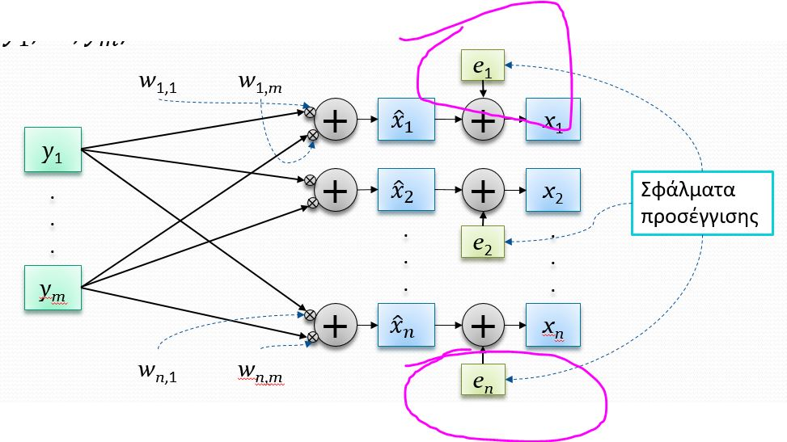

### Ανάλυση Κυρίων Συνιστώσων (PCA)

Επεξεργαζόμαστε τα αρχικά δεδομένα **x** με τους παράγοντες **y** και έπειτα εξάγουμε τα νέα δεδομένα **x**

Δεδομένα
- Παρατηρήσεις **x**(1),...,**x**(N)
- Πλήθος παραγόντων m
  
Πρόβλημα
- Εύρεση βέλτιστων πινάκων 
  - **F** μεγέθους m x n
  - **W** μεγέθους n x m
  - m <= n
- Με σκοπό την ελαχιστοποίηση του Μέσου Τετραγωνικού Σφάλματος
-  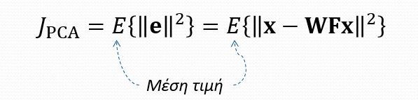

#### βέλτιστη λύση

όπου τα **u** είναι ιδιοδιανύσματα του πίνακα αυτοσυσχέτισης.
Ιδιοδιανύσματα είναι αυτά τα οποία αν πολλαπλασιαστούν με τον πινακα αυτοσυσχέτισης, θα αποτελέσουν **R**x * **u**i = λi * **u**i

|         πίνακας αυτοσυσχέτισης         |
| :------------------------------------: |
| 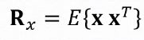 |

Σκοπός μας είναι να βρούμε τα μεγαλύτερα σε τιμή λ.

#### παράδειγμα PCA

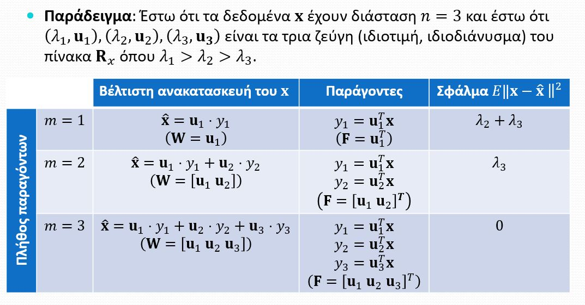

Όπου m, έχουμε και το πλήθος το διαστάσεων που χρησιμοποιούμε κάθε φορά.

#### Κύριοι άξονες, συνιστώσες

Ορισμοί
- **u** (i) : i-στό κύριο ιδιοδιάνυσμα
- λ (i) : i-στή κύρια ιδιοτιμή
- y (i) = **u**T (i) * x : i-στή κύρια συνιστώσα
- i-στος κύριος άξονας: άξονας που περνάει από την αρχή των αξόνων και είναι παράλληλος με το **u** i

Ιδιότητες:
- Κύριες Συνιστώσες (ΚΣ) είναι **ασυσχέτιστες**: Ε{y(i),y(j)} = 0
- Τα κύρια ιδιοδιανύσματα είναι ορθογώνια: **u**T (i) u (j) = 0
- Η διασπορά της i ΚΣ είναι λ (i) = E{Y (i) ^ 2} = λ (i)

#### Ζουμερό παράδειγμα PCA

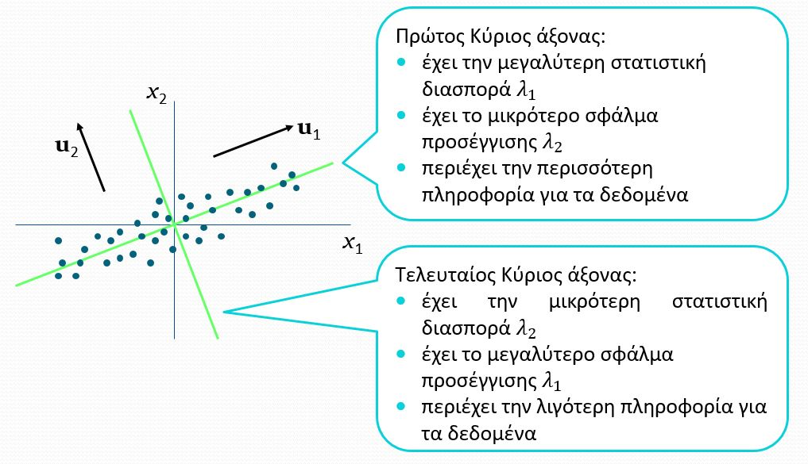

#### Κανονικοποίηση

- Σε πολλές περιπτώσεις οι μεταβλητές 𝑥_𝑖 έχουν μεγάλη διαφορά κλίμακας. Για παράδειγμα, μπορεί 𝑥_1= εισόδημα (τιμές πχ. από 5.000 έως 200.000), 𝑥_2= ηλικία (τιμές από 1 έως 100), 𝑥_3= ποσοστό κέρδους επί του τζίρου (πχ. −0.25 έως 0.25), κλπ.

- Συχνά αφαιρούμε τη μέση τιμή και διαιρούμε με τη διασπορά ώστε όλες οι μεταβλητές να έχουν περίπου την ίδια κλιμάκωση και να είναι κεντραρισμένες στο μηδέν:

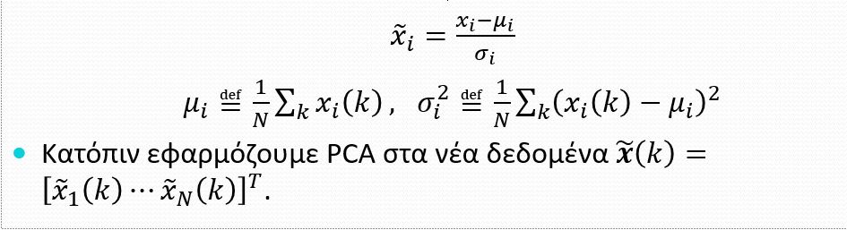