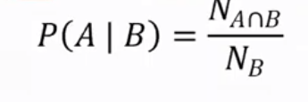
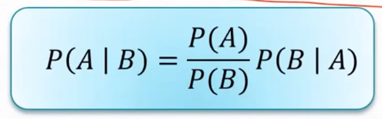
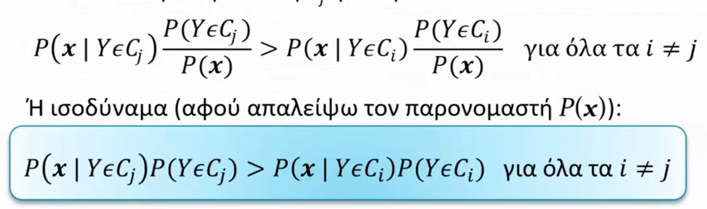
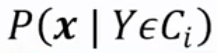
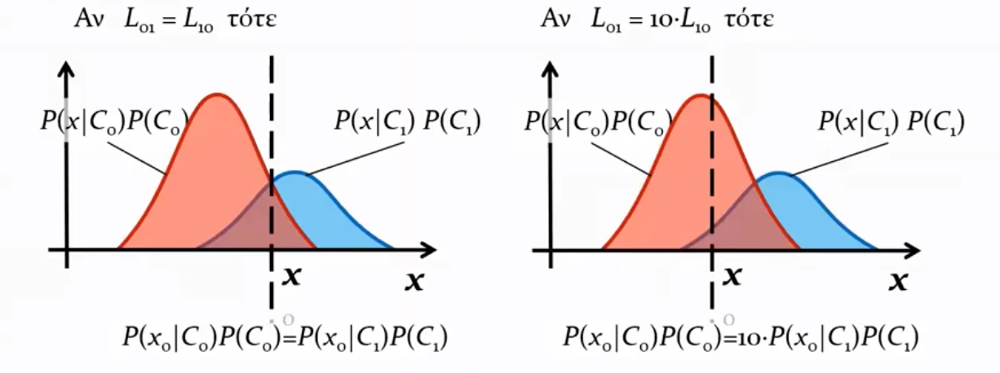
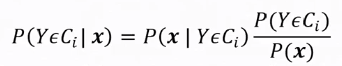

# Πιθανοτικά μοντέλα

## Δεσμευμένη Πιθανότητα (conditional probability)

ποσοστό επί ενός υποσυνόλου

## Από κοινού (joint probability)

πιθανότητα να ισχύει Α **και** Β

## Κανόνας του Bayes 

**Απόδειξη** στην 6η διαφάνεια του αντίστοιχου μαθήματος.

## Μέγιστη εκ των Υστέρων πιθανότητα (ΜεΥΠ)

Επιλέγουμε μια κλάση που μας δίνει τη μέγιστη εκ των υστέρων πιθανότητα, δηλαδή την κλάση C για την οποία ισχύει:

## Πιθανοφάνεια 

## Ελαχιστοποίηση Κόστους

Σε περιπτώσεις που τα ρίσκα λάθους διαφέρουν, τότε πρέπει να μετατοπιστούν τα πλαίσια υπολογισμού κλάσεων.  θεωρούμε L το ρίσκο:

## Ανεξάρτητες μεταβλητές

Δύο μεταβλητές X,Y λέγονται ανεξάρτητες όταν η από κοινού πιθανότητα ισούται:  

## Εκτίμηση Κατανομής πιθανότητας

Δύο βασικές ομάδες μεθόδων:

1. Μη παραμετρικές  μέθοδοι
   - Όπως το ιστόγραμμα και η μέθοδος παραθύρων. Εδώ δεν γίνεται καμιά υπόθεση για τον τύπο της συνάρτησης της κατανομής πιθανότητας
2. Παραμετρικές μέθοδοι
   - Όπως η μέθοδος μίγματος Γκαουσσιανών. Στις μεθόδους αυτές υποθέτουμε ότι η συνάρτηση κατανομής έχει συγκεκριμένη μορφή p(x;**θ**) που παραετροποιείται από το διάνυσμα **Θ**. Στην περίπτωση αυτή εκτιμούμε το καλύτερο διάνυσμα **θ = θ\*** με βάση τα δεδομένα παρατήρησης.

## Τυπολόγιο  

|         Πιθανότητα          |                      Τύπος                      |
| :-------------------------: | :---------------------------------------------: |
|    Δεσμευμένη πιθανότητα    |  |
|     Από κοινού (joint)      |        |
|        Κανόνας Bayes        |                    |
| εκ των Υστέρων (posteriori) |         |
|  πιθανοφάνεια (likelihood)  |                |