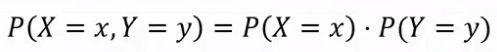

# Naive Bayes

## Εισαγωγή

Στο Naive Bayes θεωρούμε ότι τα χαρακτηριστικά Χ είναι ανεξάρτητα μεταξύ τους.

>Δύο μεταβλητές X,Y λέγονται ανεξάρτητες όταν η από κοινού >πιθανότητα ισούται:  
>

Έπειτα, υπολογίζουμε την πιθανότητα κάθε πιθανού αποτελέσματος και εκτιμούμε με βάση αυτό και τα στοιχεία του νέο προτύπου.

Ο κανόνας είναι απλός όμως συνήθως δίνει καλά αποτελέσματα.

### Παράδειγμα

Έστω ότι θέλουμε να αποφασίσουμε αν ένα μέιλ είναι σπαμ ή όχι, άρα ο στόχος t του κάθε δείγματος είναι boolean C=0/1.

Τα χαρακτηριστικά x1,x2,x3 είναι:
- x1 = έχει τη λέξη "replica" (x1=0/1) 
- x2 = έχει τη λέξη "watches" (x2=0/1) 
- x3 = έχει τη λέξη "home" (x3=0/1) 

Για να αποφασίσουμε αν ένα μήνυμα είναι σπαμ (C=1), χρησιμοποιούμε τη μέθοδο μέγιστης εκ των υστέρων πιθανότητας, δηλαδή ψάχνουμε:

Για ποιο C είναι το P(x1,x2,x3|C)P(C) μέγιστο;  

Μεταβλητές ανεξάρτητες, άρα έχουμε:

P(x1,x2,x3|C) = P(x1|C)P(x2|C)P(x3|C)

Έπειτα, υπολογίζουμε κάθε πιθανό συνδυασμό, έστω [x1=0,C=1],βρίσκοντας το πλήθος Ν των μηνυμάτος που δεν έχουν τη λέξη replica και είναι σπαμ και το διαρούμε με το πλήθος Ν όλων των σπαμ.  

P(x1=0|C=1) = N(x1=0,C=1)/N(C=1)  

Συνεχίζουμε...  

Όταν εμφανιστεί νέο πρότυπο, εκτιμούμε με βάση τις πιθανότητες των συνδυασμών.