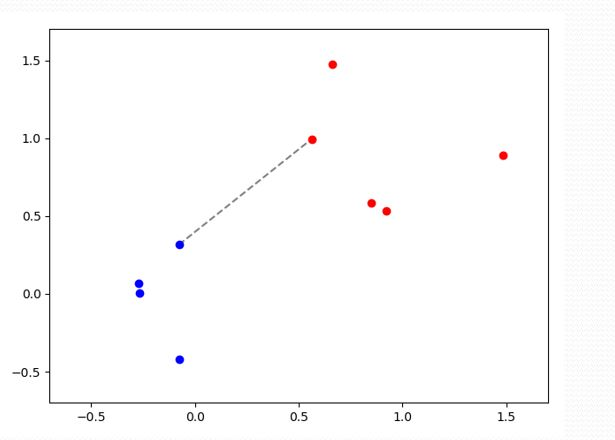
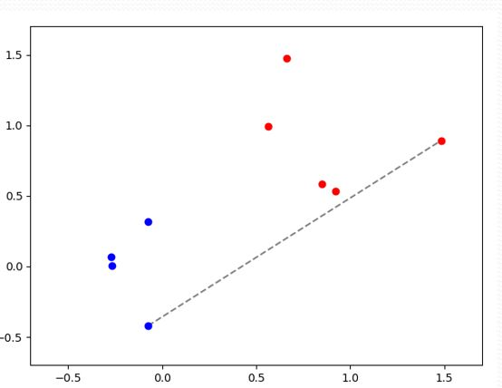
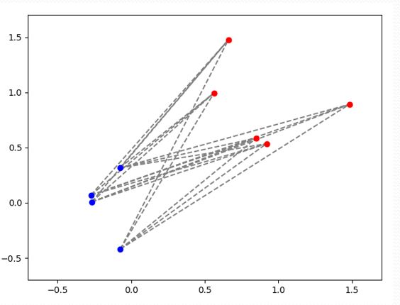

# Συσταδοποίηση

- Το πρόβλημα της συσταδοποίησης αφορά στον εντοπισμό των ομάδων (κέντρα, διασπορές κλπ) αλλά και την απόφαση για κάθε πρότυπο σε ποια ομάδα ανήκει.
- Είναι unsupervised.
- Αν γνωρίζουμε τις κατανομές ομάδων (πχ Poisson) τότε εφαρμόζουμε αλγόριθμο ΕΜ
- Αν **δεν** γνωρίζουμε τις κατανομές ομάδων, τότε εφαρμόζουε **Μίγμα Γκαουσιανών**
  - Εφαρμογή σε όσες διαστάσεις θέλουμε

## Αλγόριθμος Expectation Maximization

- Επαναληπτική Μέθοδος
- Ο χρήστης δίνει το αριθμό των ομάδων
- Για κάθε πρότυπο, υπολογίζω
  - την πιθανότητα να ανήκει σε κάθε ομάδα
- Για κάθε ομάδα, υπολογίζω
  - Μέση τιμή
  - Διασπορά
  - Prior
- Ξεκινά από λάθος εκτιμήσεις (όπως τα νευρωνικά)
- Συχνά πολύ καλή

## Η δύναμη των Γκαουσσιανών

με χρήση αθροισμάτων Γκαουσσιανών μπορούμε να προσεγγίσουμε **οποιαδήποτε συνάρτηση** κατανομής με **όση ακρίβεια** θέλουμε, αρκεί να έχουμε **αρκετές γκαουσσιανές**.

## Αλγόριθμος Κ-μέσων (K-means)

- Δεν υποθέτει κάποια συγκεκριμένη συνάρτηση κατανομής π.χ. Gaussian
- Θεωρεί γνωστό το πλήθος m των clusters (EM)
- Θεωρεί ότι κάθε cluster ci αντιπροσωπεύεται από ένα κεντρικό σημείο **μ**ι (κέντρο)
- Βήματα:
  1. Κάθε πρότυπο **x**k αντιστοιχίζεται στην ομάδα **c** της οποίας το κέντρο βρίσκεται πιο κοντά στο **x**k
  2. Το κέντρο **μ** είναι ο μέσος όρος των προτύπων που ανήκουν στην ομάδα **c**i
- Γρήγορη σύγκλιση
- Βρίσκει κέντρα εκεί που τα δεδομένα έιναι πυκνά
- Όσο περισσότερα κέντρα τόσο μικρότερςε περιοχές Voronoi

## Ιεραρχική Συσταδοποίηση 
- βασίζεται στις αποστάσεις d_ij μεταξύ σημείων και παράγει αποτελέσματα χωρίς τον ορισμό αρχικών κέντρων
- Ορίζουμε τον **τρόπο μέτρησης ανομοιότητας** συστάδων, ονόματι **Linkage**
> Μπορούμε να πούμε πως ξεκινάμε από μια μεγάλη συστάδα, και σιγά σιγά σπάμε τη συστάδα σε περισσότερες, εμφανίζοντας μια ιεραρχία. Μπορεί να συμβεί και το αντίθετο, δηλαδή θεωρούμε πως κάθε πρότυπο είναι μια συστάδα και έπειτα σύνδεοντας τα πρότυπα εμφανίζουμε την ιεραρχία.

Δύο τύποι ιεραρχικής συσταδοποίησης
### Συσσωρευτική (agglomerative)
- Ξεκίνα με κάθε σημείο ως μια συστάδα
- Επαναληπτικά, ένωσε τα σημεία με τη μικρότερη ανομοιότητα
- Απλούστερη 
  
### Διαιρετική (divisive)
- Ξεκίνα με μια συστάδα όπου όλα τα πρότυα ανήκουν σε αυτή
- Επαναληπτικά, σπάσε τις συστάδες μέχρι να επιτευχθεί η μεγαλύτερη ανομοιότητα 

### Linkage 

Μαθηματικός τύπος με τον οποίο μετράμε την απόσταση (ανομοιότητα) μεταξύ δύο συστάδων, έτσι ώστε να αποφασίσουμε ποιες από τις 2 θα ενωθούν

#### 3 είδη Linkage

|    Ονομασία    |                                             Μεθοδολογία                                              | εικόνα |
| :------------: | :--------------------------------------------------------------------------------------------------: | :----: |
| Single Linkage | Η απόσταση μεταξύ δύο συστάδων είναι η απόσταση μεταξύ των δύο **κοντινότερων** σημείων των δύο συστάδων | |
| Complete Linkage | Η απόσταση μεταξύ δύο συστάδων είναι η απόσταση μεταξύ των δύο **μακρυνότερων** σημείων των δύο συστάδων ||
| Average Linkage | Η απόσταση μεταξύ δύο συστάδων είναι η **μέση απόσταση** μεταξύ των δύο συστάδων ||

 
 
 

 
 
 
**Προβλήματα**

| Linkage | Πρόβλημα |
| :-- | :--|
| Single Linkage | Φαινόμενο chaining: οι συστάδες είναι απλωμένες και όχι συμπαγείς, με αποτέλεσμα να υπάρχει μια μεγάλη συστάδα και μια μικρή (Μακαρόνι)|
|Complete Linkage | Φαινόμενο crowding συμπαγείς συστάδες αλλά πολύ απομακρυσμένες μεταξύ τους|
| Average Linkage | Ισοροπία των παραπάνω. Δεν είναι σαφές τι ιδιότητα έχουν οι συστάδες.|
