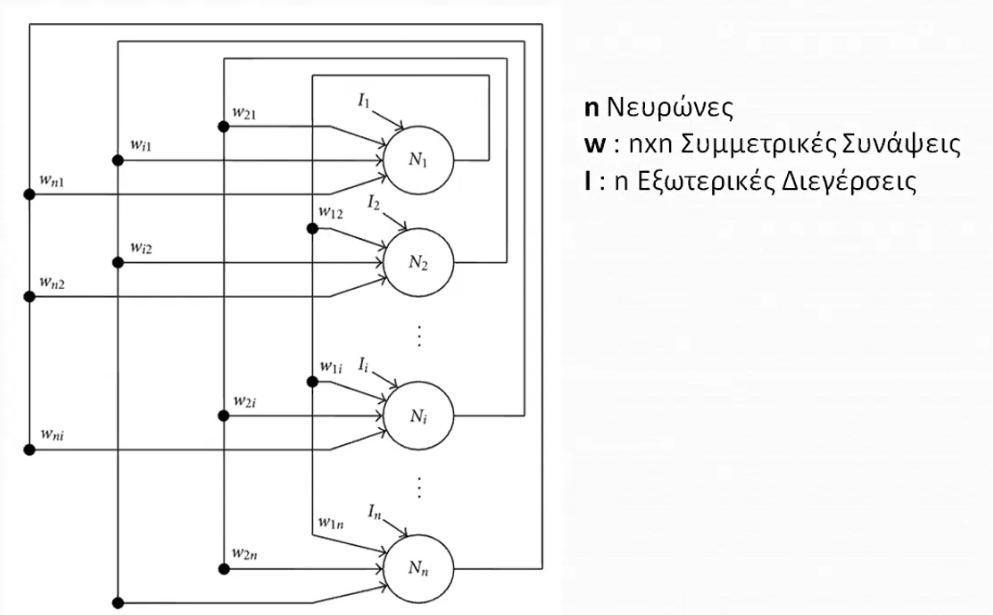

## Multilayer Perceptron

 

### Αλγόριθμος Back Propagation

1. Ορίζουμε τυχαίες τιμές για τα βάρη κάθε στρώματος.

2. Forward Phase
   1. Υπολόγισε τις εξόδους του πρώτου στρώματος
   2. Έχοντας ως **εισόδος τις εξόδους** του προηγούμενου στρώματος, υπολόγισε τις επόμενες εξόδους.
3. Backward Phase
   1. Υπολόγισε τα σφάλματα του τελευταίου στρώματος με βάση την τελευταία έξοδο / στόχο
   2. Υπολόγισε τα σφάλματα των προηγούμενων εξόδων με βάση τις εξόδους των επόμενων
4. Ενημέρωση Βαρών με βάση τον κανόνα Δέλτα

## Softmax

- Πιθανοτικό μοντέλο
- Βασίζεται στη σιγμοειδή συνάρτηση - logistic sigmoid 
- Οι έξοδοι είναι πιθανότητες
- Νευρώνες όσοι και οι κλάσεις

## Άνταγωνιστική Μάθηση

- Τυχαίοι νευρώνες πλήθους δοσμένου από χρήστη (ύπερ παράμετρος)
- Με κάθε επανάληψη, οι νευρώνες φτάνουν κοντά σε **ομάδες** (όχι κλάσεις).
- Οι ομάδες έχουν ίσο πλήθος με αυτό των νευρώνων.
- Γενικά θα πρέπει να ορίσουμε **Πλήθος Κλάσεων = Πλήθος Νευρώνων**
- Το **βήμα** (ύπερ παράμετρος) δεν θα πρέπει **ποτέ** να είναι 1 γιατί έτσι κάθε νευρώνας θα φτάσει κατευθείαν επάνω σε ένα πρότυπο και όχι κοντά του.

## Αναδρομικά / Hopfield

- Χρησιμοποιούνται συχνά για ανάκληση μνήμης

**Αρχιτεκτονική δικτύου**
- Οι συνάψεις συνδέουν όλους τους νευρώνες **με τους υπόλοιπους και τον εαυτό τους**.

**Τύποι Μνήμης**
  - Αυτοσυνειρμική: Από την ατελής είσοδο παίρνουμε το **πλήρες** αποθηκευένο πρότυπο (Κομμάτι φωτογραφίας -> Ολόκληρη φωτογραφία)
  - Ετεροσυνειρμική: Από το ατελές πρότυπο εισόδου παίρνουμε έξοδο διαφορετική από το πρότυπο εισόδου

**Τρόποι Ανάκλησης**
  - Σύγχρονος: Οι νευρώνες **ενεργοποιούνται όλοι μαζί** και το επόμενο διάνυσμα εισόδου αποτελείται από πλήρως ενημερώμενες τιμές
  - Ασύγχρονος: Με κάθε ενεργοποίηση νευρώνα, υπάρχει μια νέα επανάληψη εισόδου η οποία αποτελέιται από τις **παλιές τιμές** εισόδου μαζί με την **νέα είσοδο** από την ενεργοποίηση του τελευταίου νευρώνα

### Hopfield

- Δεν εκπαιδεύεται. Οι συνάψεις αποθηκεύουν κάποιες σταθερές τιμές (**Αποθήκευση στη μνήμη**).
- Τύπος μνήμης: Αυτοσυνειρμική.