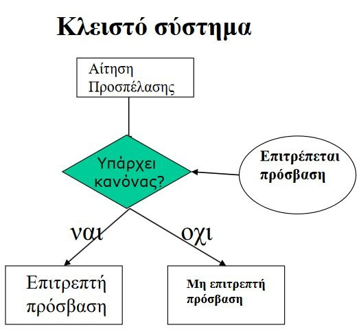
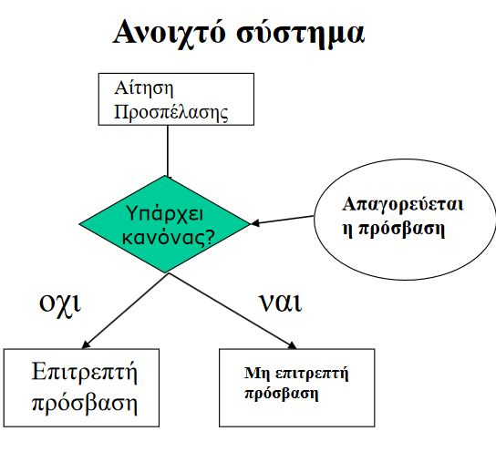
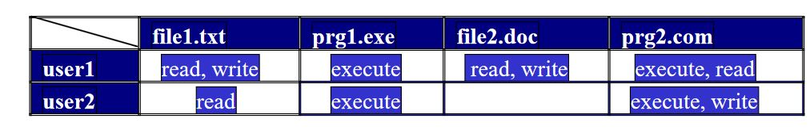
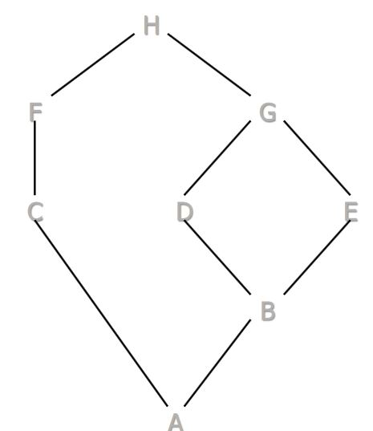

# Μοντέλα και πολιτικές ασφάλειας

### Ασφαλές ή Έμπιστο υπολογοστικό σύστημα;
|             Ασφαλές             |  Έμπιστο                                                 |
| --------------------------- | --------------------------------------------------------- |
|      Είναι ή δεν είναι ασφαλές       | Βαθμίδες Εμπιστοσύνης                     |
|      Βεβαιούμενο στη βάση χαρακτηριστικών      | Κρινόμενο με βάση γεγονότων και αναλύσεων                     |
| Απόλυτο | Σχετικό: Πλαισιώνεται στη χρήση                        |
|         Σκοπός         | Χαρακτηριστικό                       |

## Πολιτικές Ασφάλειας

Η **πολιτική ασφάλειας** είναι ένα σύνολο από **αρχές (principles)** και **οδηγίες υψηλού επιπέδου (high level guidelines)**.  
Εκφράζεται με κανόνες προσπέλασης που ρυθμίζουν **πως ελέγχεται** και **πως λαμβάνονται οι αποφάσεις για αυτή**.

   
### Μηχανισμοί Ασφάλειας

**Χαμηλού επιπέδου** λειτουργίες λογισμικού και υλικού που διαμορφώνονται κατάληληες για την υλοποίηση μιας πολιτικής ασφάλειας.

1. Αναγνώριση (identification)
2. Αυθεντικοποίηση (Authentication)
3. Εξουσιοδότηση (Authorization)
4. Έλεγχος Προσπέλασης (Access Control)
5. Ακεραιότητα (Integrity)
6. Συνέπεια (Consistency)
7. Επίβλεψη (Auditing)

   
### Υποκείμενα & Αντικείμενα
|             Υποκείμενο             |  Αντικείμενο                                                 |
| --------------------------- | --------------------------------------------------------- |
|      Ενεργό στο σύστημα (Χρήστες, Διεργασίες, Προγράμματα)       | Ενεργείται από Υποκείμενο (Αρχεία, Φάκελοι, Συσκευές)                     |

### Τρόποι Προσπέλασης

1. Παρατήρηση (Observe)
2. Μετατροπή (alter)

### Πολιτικές Προσπέασης : Κλειστό & Ανοιχτό Σύστημα

Θεωρούμε ως κανόνα μια αναφορά σε οντότητα.

|             Κλειστό Σύστημα             |  Ανοιχτό Σύστημα                                                 |
| --------------------------- | --------------------------------------------------------- |
| |  |
|**Επιτρέπεται** η πρόσβαση ΜΟΝΟ στο περιεχόμενο κανόνων που έχουν αναφερθεί. Οποιαδήποτε άλλη οντότητα δεν είναι προσπελάσιμη.| **Απαγορεύεται** η πρόσβαση ΜΟΝΟ στο περιεχόμενο κανόνων που έχουν αναφερθεί. Οποιαδήποτε άλλη οντότητα είναι προσπελάσιμη.|
| Θα πας και θα πάρεις ψωμί, αυγά, φέτα και ελιές. *Βρισκόμαστε σε καραντίνα και τίποτα άλλο δεν επιτρέπεται.* |*Παιδί μου, να ζήσεις τη ζωή σου όπως θες, αλλά μην πάρεις ποτέ παράνομες ουσίες.*|

   
#### Ιδιοκτησία

Δύο βασικές προσεγγίσεις: 

|             Πολιτική κατά-διάκριση (discretionary)             |  Πολιτική κατά-απαίτηση (mandatory)                                                 |
| --------------------------- | --------------------------------------------------------- |
| Ο owner του πόρου αποφασίζει ποιος μπορεί να το προσπελάσει. | Η προσπέλαση αποφασίζεται κεντρικά και ισχύει για ολόκληρο το σύστημα.|

   
### Μοντέλα Ασφάλειας

Ένα μοντέλο ασφάλειας εκφράζει τις απαιτήσεις και τους μηχανισμούς πολιτικής ασφάλειας ενός συστήματος.

**S** - Σύνολο υποκειμένων  
**O** - Σύνολο αντικειμένων  
**A** - Σύνολο λειτουργιών προσπέλασης  
**L** - Επίπεδο ασφάλειας  
**C** - Σύνολο κατηγοριών

Για κάθε ζεύγος (Υποκείμενο, Αντικείμενο) όριζεται ένα σύνολο δικαιωμάτων που ανήκουν σε χρήστη.

  
#### Δικτυωτό Μοντέλο (Lattice model)

Τα στοιχεία είναι μερικώς ταξινομημένα (partially ordered) σύμφωνα με τη σχέση A <= B η οποία είναι
- μεταβατική (αν A<=B και b<=C τότε A<=C)
- αντισυμμετρική (αν A<=B και B<=A τότε A=B)

Υπάρχουν πάντα στοιχεία ορίων έτσι ώστε Χ <= Α και Y >= Α για κάθε Α.

> Η στρατιωτική πολιτική ασφάλειας βασίζεται στο δικτυωτό μοντέλο. Στο άνω όριο θεωρούμε "άκρως απόρρητο" και στο κάτω όριο "αδιαβάθμητο"

   
#### Bell-La Padula

Μια φορμαλιστική περιγραφή επιτρεπόμενων διαδρομών ροής πληροφοριών σε ένα ασφαλές σύστημα.

Κάθε σύστημα θεωρείται ότι περιέχει ένα σύνολο **υποκειμένων S** και ένα σύνολο **αντικειμένων O**.  
Σε κάθε S και Ο εκχωρείται μια **ετικέτα ασφάλειας (security Label)**.
> Η ετικέτα του Ο καλείται **διαβάθμιση (classification)** και εκφράζει την **ευαισθησία των δεδομένων.**

>Η ετικέτα ενός S καλείται **εκκαθάριση (clearance)** και εκφράζει τη **φερεγγυότητα (trustworthiness)** του στο να μη φανερώσει τις ευαίσθητες πληροφορίες σε τρίτους.

  
Μια ετικέτα ασφάλειας περιέχει:
1. **Επίπεδο L** ευαισθησίας "*απόρρητο, εμπιστευτικό"*
2. **Σύνολο κατηγοριών C** δεδομένων που αναπαριστούν τις κλάσεις των τύπων δεδομένων "*ιατρικά, λογιστικά*"

|             Επίπεδα Ασφαλείας             |  Ετικέτες Ασφαλείας                                                 |
| --------------------------- | --------------------------------------------------------- |
|     Πλήρης ταξινόμηση      | Μερική ταξινόμηση        |

> Μια ετικέτα ασφάλειας S1 = (L1, C1) επικρατεί (dominates) μιας ετικέτας ασφάλειας S2 = (L2, C2) δηλαδή S1 >= S2, ένα και μόνο αν:
> - L1 >= L2
> - C1 υποσύνολο του C2

  
Κανόνες ροής πληροφορίας
1. Απλή ιδιότητα | Διάβασμα μόνο προς τα κάτω 
2. Ιδιότητα Αστερίσκου (*-property) | Εγγραφή αντικειμένου α μόνο υποκείμενα β όπου Sα <= Sβ 

  
#### Συγκαλυμμένα κανάλια (covert channels)

Μια ροή πληροφοριών που δεν ελέγχεται από τους μηχανισμούς ασφάλειας του συστήματος.  
Είναι μια αδυναμία του **Bell-La Padula**.

**Παράδειγμα**

1. Ένα χαμηλού επιπέδου Sa δημιουργεί αντικείμενο O στο επίπεδο του.
2. Ένα υψηλού επιπέδου Sb αναβαθμίζει το επίπεδο ασφάλειας του Ο
3. Το Sa προσπαθεί να διαβάσει το Ο αλλά αποτυγχάνει, φανερώνοντας την ενέργεια του Sb. Το κομμάτι πληροφορίας έχει ρεύσει από πάνω προς τα κάτω.

*Έξυπνο παράδεγιμα που ειπόθηκε στην τάξη*

Η στοχοποίηση των ανθρώπων με το κρούσμα του Covid-19 δεν επιτρέπεται, οπότε οι γιατροί προσπαθούν να αποτρέψουν την διαρροή αυτής της πληροφορίας, έχοντας ένα ειδικό τμήμα Covid-19 όπου οι πληροφορίες ασθενών δεν βγαίνουν προς τα έξω, ακόμη και μεταξύ του προσωπικού του νοσοκομείου.  
Έστω ότι σε ένα νοσοκομείο καταφθάνει ένας ασθενής. Ένας ειδικευόμενος τον εξετάζει και τον παραπέμπει στο ειδικό τμήμα για τον Covid-19 στο οποίο δεν έχει πρόσβαση. Στο τμήμα αυτό, ο ασθενής παραμένει για παραπάνω από 10 ημέρες. Συνεπώς, ανεξάρτητα από το αν οι γιατροί έχουν πληροφορήσει τον ειδικευόμενο, ο ίδιος γνωρίζει πως ο ασθενής είναι θύμα του κρούσματος.

  
**Λύση στο πρόβλημα: Χρήση πολλαπλών αντιγράφων (polyinstantiation)**  

Ένα αντικείμενο μπορεί να έχει διαφορετικές τιμές σε διαφορετικά επίπεδα ασφάλειας.

   

## Πολιτικές Ασφάλειας 

**Στρατιωτικές** και **Εμπορικές**

### Στρατιωτικές

- Προστασία διαβαθμισμένων πληροφοριών.
- Η προσπέλαση πληροφοριών γίνεται μόνο αν το υποκείμενο έχει ανάγκη να γνωρίζει την πληροφορία.

 

#### Υποδιαιρέσεις (compartments)

- Κάθε τμήμα διαβαθμισμένης πληροφορίας μπορεί να σχετίζεται με ένα ή περισσότερα έργα που ονομάζονται υποδιαιρέσεις (compartments) και περιγράφουν την αντικειμενική σημασία της πληροφορίας.
- Οι υποδιαιρέσεις βοηθούν στην επιβολή περιορισμών ανάγκης-για-γνώση ώστε τα άτομα να έχουν πρόσβαση μόνο στην πληροφορία που είναι σχετική με τις εργασίες τους. 
- Κάθε τμήμα πληροφορίας μπορεί να σχετίζεται με μια ή περισσότερες υποδιαιρέσεις. Άρα για κάθε τμήμα πληροφορίας ορίζεται ένα σύνολο υποδιαιρέσεων, π.χ. {project1, project4, Athens}.

 

#### Ορολογία Στρατιωτικών πολιτικών

|             Όρος             |  Επεξήγηση |
| --------------------------- | --------------------------------------------------------- |
|     Κλάση / Διαβάθμιση πληροφορίας      | Βαθμός L + Σύνολα Υποδιαιρέσεων|
|     Εκκαθάριση      | Ταύτιση με κλάση. Είναι μια ένδειξη ότι το πρόσωπο είναι έμπιστο για να προσπελάσει πληροφρίες μέχρι το κάποιο επίπεδο.|
|     Επικράτηση (dominance)      | Ένα S επικρατεί σε Ο έαν ισχύουν : S.L >= O.L && S.υποδιαιρέσεις ΥΠΟΣΥΝΟΛΟ ΤΟΥ O.υποδιαιρέσεις |

  
### Εμπορικές Πολιτικές ασφάλειας

####  Clark-Wilson

Χρήση τριάδων προσπέλασης μορφής  **[userID,TPi,{CDIj,CDI,...}]**  

|             Όρος             |  Επεξήγηση |
| --------------------------- | --------------------------------------------------------- |
|     userID      | Ταυτότητα εξουσιοδότησης χρήστη |
|     TP      | Διαδικασία μετασχηματισμού|
|     CDI        | Περιοριζόμενα στοιχεία δεδομένων που ο χρήστης

  
 

#### Διαχωρισμός Καθηκόντων

>Στο προηγούμενο παράδειγμα, διάφοροι άνθρωποι εξουσιοδοτούνται να εκδίδουν παραγγελίες, να παραλαμβάνουν υλικά και να γράφουν επιταγές. Όμως, δεν είναι επιθυμητό όλες αυτές τις εργασίες να τις εκτελεί το ίδιο πρόσωπο. Για αυτό χρειάζεται να προβλέπεται από την πολιτική ασφάλειας ότι διαφορετικοί άνθρωποι εκτελούν κάθε ένα από τα παραπάνω βήματα.

Οι τριάδες των Clark και Wilson είναι “χωρίς κατάσταση” (stateless), που σημαίνει ότι σε μια τριάδα δεν είναι διαθέσιμο το πλαίσιο των προηγούμενων λειτουργιών. Επομένως, οι τριάδες **δεν μπορούν να μεταφέρουν πληροφορία ελέγχου από άλλες τριάδες.**

 

#### Σινικό Τείχος

|             Όρος             |  Επεξήγηση |
| --------------------------- | --------------------------------------------------------- |
|     Αντικείμενα (objects) |  Στο κατώτερο επίπεδο υπάρχουν αντικείμενα, όπως αρχεία. Κάθε αρχείο περιέχει πληροφορίες που αφορούν μόνο μια εταιρεία. 
|     Εταιρικές Ομάδες (company groups)      | Στο επόμενο επίπεδο, όλα τα αντικείμενα που αφορούν κάθε εταιρεία ομαδοποιούνται μαζί.|
|     Κλάσεις Ανταγωνισμού (conflictc lasses).       | Στο ανώτερο επίπεδο, όλες οι ομάδες αντικειμένων των ανταγωνιστικών εταιρειών συγκεντρώνονται σε διαφορετικούς ομίλους (clusters). |

> Ιδιαίτερο ενδιαφέρον παρουσιάζει η δυναμική αλλαγή των αδειών προσπέλασης καθώς όταν ένα υποκείμενο προσπελαύνει κάποια αντικείμενα, αποκλείεται αυτόματα από το να προσπελάσει κάποια από τα αντικείμενα στα οποία προηγουμένως είχε πρόσβαση

 

### Κατά-Διάκριση Έλεγχος Προσπέλασης (Discretionary Access Control -DAC)

Ένα υποκείμενο μπορεί να μεταδώσει μια άδεια προσπέλασης σε οποιοδήποτε άλλο υποκείμενο, εξουσιοδοτώντας το να έχει πρόσβαση σε ένα αντικείμενο ή ακόμη και να έχει τη δυνατότητα εξουσιοδότησης κάποιου τρίτου υποκειμένου σε αυτό.

**Access Rule = (o, s, t)**

o : Αντικείμενο  
s : Υποκείμενο  
t : Δικαίοωμα προσπέλασης

##### Χρήση στα περισσότερα ΣΔΒΣ.

 

### Βασισμένος-σε-Ρόλους Έλεγχος Προσπέλασης (Role-Based Access Control -RBAC)

Κανονίζουν την προσπέλαση των πληροφοριών στην βάση των ενεργειών που οι χρήστες εκτελούν μέσα στο σύστημα, με:
- προσδιορισμό των ρόλων στο σύστημα
- καθορισμό των προσπελάσεων των ρόλων και
- εκχώρηση ρόλων στους χρήστες. 

Στις βασισμένες-σε-ρόλους πολιτικές:
- ο προσδιορισμός των εξουσιοδοτήσεων σε αντικείμενα παραχωρείται (grant) σε χρήστες, όπως στην κατά-διάκριση προσέγγιση, αλλά μέσω ρόλων
- ενώ υπάρχει η δυνατότητα προσδιορισμού περιορισμών (όπως στην κατά-απαίτηση προσέγγιση) που αφορούν την παραχώρηση ή χρήση τέτοιων εξουσιοδοτήσεων.

   

### Ερωτήσεις Κατανόησης

1. Σε ένα file systemενός Λειτουργικού συστήματος υπάρχουν οι χρήστες και τα αρχεία.  Ποια πολιτική ελέγχου πρόσβασης υλοποιείται στα συστήματα αυτά για να ελέγχεται ποιος χρήστης έχει δικαίωμα σε ποια αρχεία; Ποια είναι τα βασικά χαρακτηριστικά αυτής της πολιτικής ασφάλειας;

2. Κατά τη δημιουργία ενός web site υπάρχουν τρεις κατηγορίες χρηστών (admin, staff, public) που δεν έχουν τα ίδια δικαιώματα πρόσβασης επάνω στο site. Ποια πολιτική ελέγχου πρόσβασης θα υλοποιήσετε; 

3. Σε ένα οργανισμό π.χμια τράπεζα για να αποτρέπεται το φαινόμενο κατάχρησης εξουσίας, δηλ. να μην μπορεί ένας χρήστης να έχει πρόσβαση σε όλη την ακολουθία υπηρεσιών που απαιτούνται για να ολοκληρωθεί μια ενέργεια, ποια πολιτική ασφάλειας θα προτείνατε και ποια τα βασικά της χαρακτηριστικά;

4. Ποια πολιτική ελέγχου πρόσβασης θα προτείνατε σε cloud services (Storage as a Service);