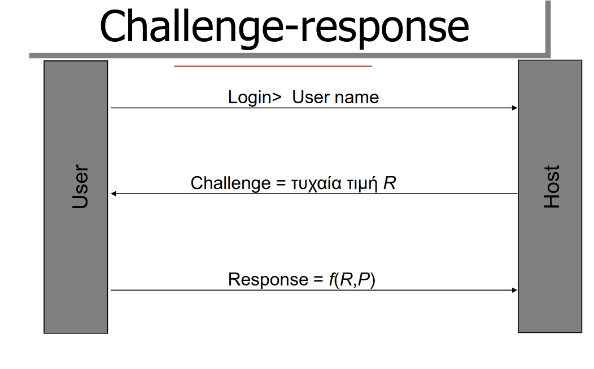
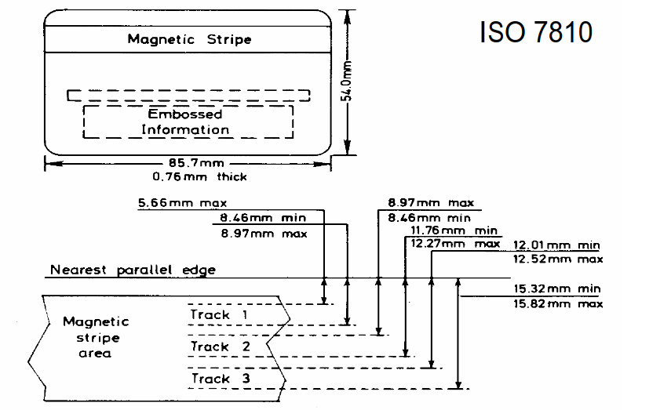
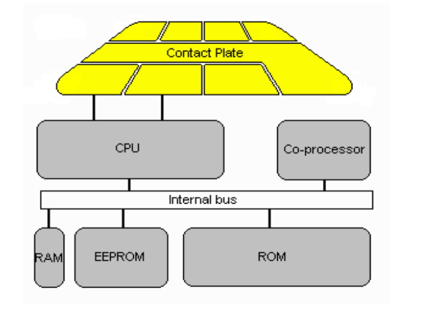

# Προσδιορισμός της ταυτότητας

### Τεχνικές Αναγνώρισης & αυθεντικοποίησης

1. Με βάση κάτι που είναι γνωστό
2. Με βάση κάτι που κατέχεται
3. Με βάση κάτι που είναι

 

#### Σκοπός Αναγνώρισης

1. Έλεγχος πρόσβασης
2. Περιορισμος πρόσβασης σε προστατευόμενες περιοχές
3. Ελεγχόμενη χρήση τερματικών 

#### Σκοπός Αυθεντικοποίησης

*Διαδικασία επιβεβαίωσης ταυτότητας χρήστη*

1. Ταυτότητα χρήστη ως παράμετρος λήψης αποφάσεων ελέγχου προσπέλασης
2. Καταγραφή ταυτότητας και πράξεις χρήστη στο σύστημα σε ένα χώρο καταγραφής (audit trail)

#### Αναγνώριση vs Αυθεντικοποίηση

Υπάρχει **διαφορά** μεταξύ της **πληροφορίας που χρειάζεται για την αναγνώριση** ενός προσώπου και της πληροφορίας που απαιτείται για την **επιβεβαίωση ότι κάποιος είναι πράγματι το πρόσωπο που ισχυρίζεται ότι είναι.**

 
 
 

### Αυθεντικοποίηση

- Πρώτη γραμμή άμυνας
- Αποτρέπει κινήσεις και πρόσβαση χρηστών πριν από την εξουσιοδότηση τους.

**Τεχνικές Αυθεντικοποίησης**

|         Έιδος          | Παράδειγμα                     |
| :--------------------: | ------------------------------ |
| Κάτι που είναι γνωστό  | Password / PIN                 |
|   Κάτι που κατέχεται   | RFID / Smart Card / Passport   |
| Από τον ίδιο το χρήστη | Δαχτυλικό αποτύπωμα / Υπογραφή |

### Συνθηματικά

- Ο πιο διαδεδομένο τρόπος αυθεντικοποίησης
- χρήση μαζί με username (duh)

Βασικές Διαδίκασίες
1. ξεχωριστά συνθηματικά για κάθε πρόσωπο
2. Μεγάλες συμβολοσειρές
3. Αποφυγή έκθεσης σε τρίτους 
4. Τακτική ανανέωση

##### Συνθηματικά Μιας χρήσης

Χρήση λίστας συνθηματικών και χρήση ενός από αυτά κάθε φορά (μια και μοναδική φορά) μέχρι να εξαντληθούν όλα.

##### Αποθήκευση Συνθηματικών

Χρήση μονόδρομης συνάρτησης (one-way function) που να είναι **εύκολο να υπολογίζεται** και **δύσκολο να αναστραφεί**. Η επιβεβαίωση γίνται με εφαρμογή της συνάρτησης και σύγκριση με την αποθηκευμένη τιμή στο σύστημα
 

##### Μεταφορά συνθηματικών

Η μεταφορά σε ένα ανασφαλές δίκτυο είναι ευπαθή για υποκλοπή(!)

Λύση: Challenge Response

 
 

#### Challenge Response 

- Ο χρήστης και το σύστημα γνωρίζουν το συνθηματικό P
- Η μονόδρομη συνάρτηση f(R,P) και το R **δεν αποκαλύπτουν** το P
- Οι χρήστες πρέπει να έχουν τα μέσα για γρήγορο υπολογισμό της f

 
 
 

### Κουπόνια

Παραδείγματα: κλειδία / Ταυτότητες / Διαβατήρια

Προβλήματα: Απώλεια / Αντιγραφή / Παραποίηση

#### Μαγνητικές Κάρτες

*Περίεργες πληροφορίες που ελπίζω να μην πέσουν στην εξεταστική*

- Διαστάσεις και μορφή με βάση το πρότυπο ISO 7810
- Χρήση με κάποιο pin

| Περίπτωση        | Μέθοδος                                                                    |
| :--------------- | -------------------------------------------------------------------------- |
| Off-Line Σύστημα | Αποθήκευση στην κάρτα  με κρυπτογράφηση ή σύγκριση μέσω Challenge Response |
| On-line          | Επιβεβαίωση στα κεντρικά και όχι στην ίδια την κάρτα                       |

 
 

 
 

#### Smart Cards

*Flexxed out Πληροφοριές*

- Μικροεπεξεργαστές μνήμης RAM και ROM
- Περισσότερη μνήμη (~35ΚΒ) από μαγνητικες (=250 Β)
- Ενσωματωμένη υπολογιστική ισχύ
- Φυσική προστασία αποθηκευμένων δεδομένων

*More Πληροφοριές*

- Η συλλογή πληροφοριών καθορίζονται από το πρότυπο ISO/IEC 7816
- Δύσκολο στην αντιγραφή λόγω της κρυφής εσωτερικής σχεδίασης από τους κατασκευαστές

 
 

 
 

! Μπορείτε να διαβάσετε περισσότερες λεπτομέρειες για τα Smart Cards στις διαφάνειες του κυρίου Ηλιούδη.

### Αυθεντικοποίηση από προσωπικά χαρακτηριστικά

Δυσάρεστα Facts
1. Τα συνθηματικά αποκαλύπτονται ή μαντεύονται...
2. Τα κουπόνια χάνονται ή κλέβονται...

Για αυτό τον λόγο επιλέγουμε τη χρήση προσωπικών χαρακτηριστικών!  
Οι συσκευές μέτρησης χαρακτηριστικών πρέπει να είναι έμπιστες διαφορετικά είναι δυνατή η αναπαραγωγή νόμιμων μετρήσεων από **εισβολείς**

#### Αυτόματη αναγνώριση

Τα περισσότερα συστήματα αυτόματης αναγνώρισης βασίζονται στη μέτρηση χαρακτηριστικών χρήσης για **μη-αυτόματη αναγνώριση** όπως:
- Υπογραφές
- Δαχτυλικά αποτυπώματα
- Φωνή

##### Βιομετρική Αναγνώριση

Είναι μια αυτόματη αναγνώριση 2 σταδίων:

1. Στάδιο εγγραφής ατόμου
2. Στάδιο αναγνώρισης ατόμου

| Πλεονεκτήματα                                       | Μειονεκτήματα                                                            |
| :-------------------------------------------------- | ------------------------------------------------------------------------ |
| Μέγιστη επιτυχή διάγνωση ταυτότητας                 | Αρκετά ακριβή τεχνολογία                                                 |
| Χρήση προσδιορισμού ταυτότητας αλλά και επαλήθευσης | Αλλοίωση ανθρώπινων χαρακτηριστικών με το πέρασμα του χρόνου όπως η φωνή |
| Έυκολη χρήση                                        |