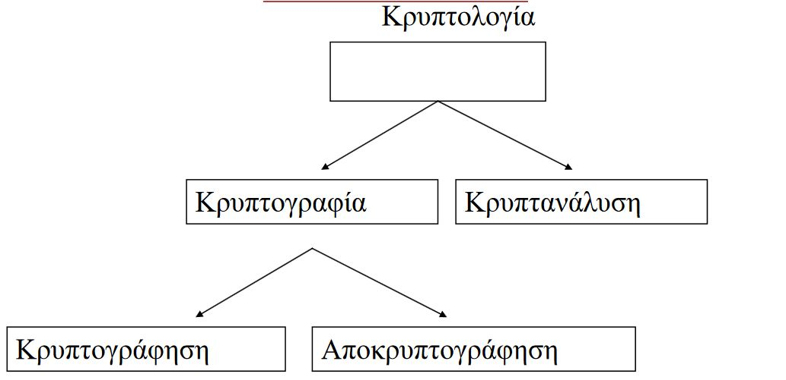
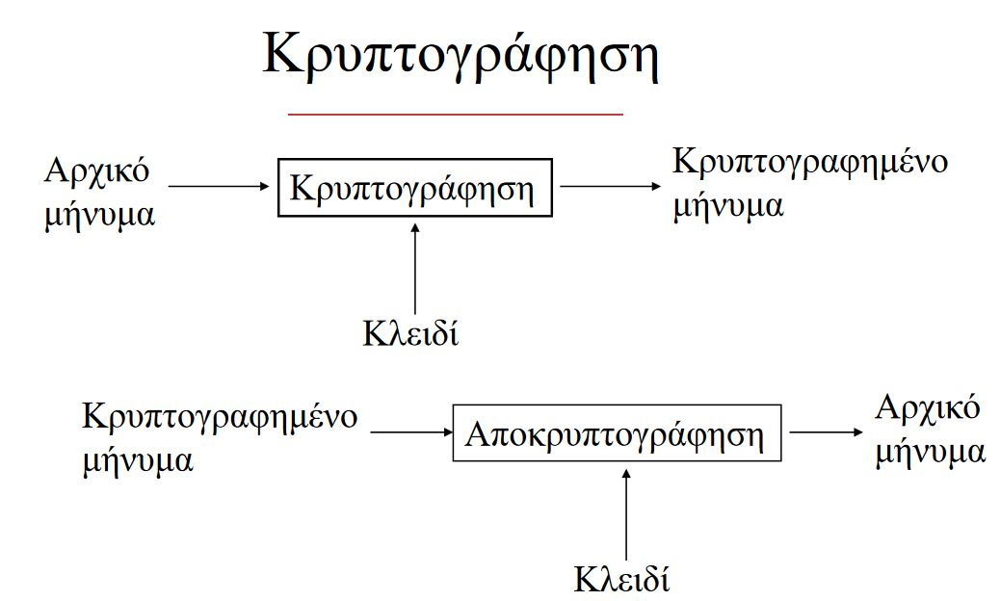
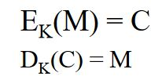
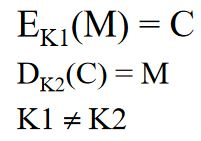
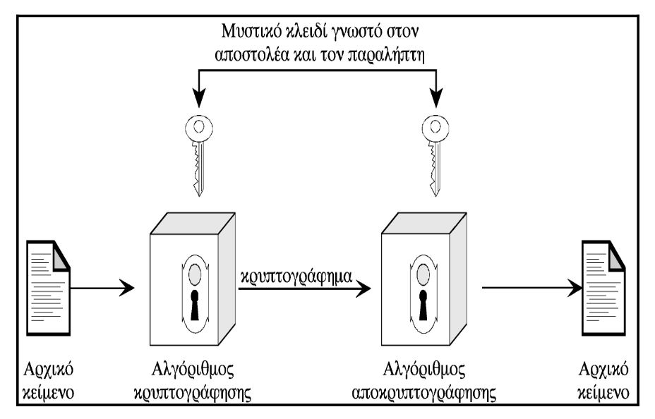
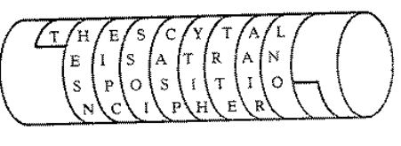

# Κρυπτογραφία

## Εισαγωγή

Σκοπός
1. Εμπιστευτικότητα
2. Ακεραιότητα
3. Μη αποκήρυξη
4. Πιστοποίηση

### Δέντρο Κρυπτογραφίας

### Η κρυπτογράφιση με 13 λέξεις

### Απαιτήσεις

1. Αλγόριθμος
2. Κλειδί (Μέτρηση σε bits)
3. Αρχικό κείμενο
4. Κρυπτογραφημένο κείμενο

### Κρυπτογράφηση vs Κωδικοποίηση

| Κρυπτογράφηση                                     | Κωδικοποίηση                                                                                      |
| :------------------------------------------------ | ------------------------------------------------------------------------------------------------- |
| Μετασχηματισμός μηνύματος σε **ακατανόητη** μορφή | Αναπαράσταση μιας πληροφορίας σε κάποια **άλλη μορφή** (π.χ. για να διευκολύνει την επεξεργασία). |

### Ασφάλεια Αλγορίθμου

1. Μήκος κλειδιού
2. Απόκρυψη αλγορίθμου (Εφικτό με χρήση hardware)

## Αλγόριθμοι

M: Μήνυμα  
C: Κρυπτογράφημα  
E: Διεργασία κρυπτογράφησης  
D: Διεργασία αποκρυπτογράφησης  
Κ: Κλειδί

|                Συμμετρικοί                |                Ασύμμετροι                 |
| :---------------------------------------: | :---------------------------------------: |
|                 1 κλειδί                  |                 2 κλειδία                 |
|  |  |

### Κριτήρια Ταξινόμησης

1. Τύπος διαδικασιών
2. Αριθμός κλειδιών
3. Τρόπος επεξεργασίας αρχικού κειμένου

### Κριτήρια ασφαλούς σχήματος κρυπτογράφησης

1. Το κόστος παραβίασης κρυπτομηνύματος υπερβαίνει την αξία της πληροφορίας
2. Ο χρόνος κρυπτανάλυσης υπερβαίνει την ωφέλιμη διάρκεια ζωής λήψης πληροφορίας
### Συμετρικά Κρυπτοσυστήματα

#### Επιμέρους οντότητες

1. Αρχικό κείμενο
2. Αλγόριθμος κρυπτογράφησης
3. Μυστικό κλειδί
4. Κρυπτογράφημα
5. Αλγόριθμος Αποκρυπτογράφησης

#### Προϋποθέσεις
- Ισχυρός αλγόριθμος Κρυπτογράφησης
- **Ασφαλής** παραλαβή αντιγράφων μυστικού κλειδιού και διαφύλαξη τους σε ασφαλές μέρος

Απλοποιημένο μοντέλο συμετρικής κρυπτογραφίας  

#### Αδύναμος Κρίκος

Ο αδύναμος κρίκος σε αυτή τη φάση είναι η **μυστικότητα του κλειδιού** και όχι η μυστικότητα του αλγορίθμου

### Αλγόριθμοι Αντικατάστασης

| Απλής αντικατάστασης / μονοαλφαβητικοί | Ομοφωνικής αντικατάστασης | Πολυγραμμικής αντικατάστασης  |     Πολυαλφαβητικής αντικατάστασης      |
| :------------------------------------: | :-----------------------: | :---------------------------: | :-------------------------------------: |
|              Ένα προς Ένα              |      Ένα προς πολλά       | Μία προς μία ομάδα χαρακτήρων | σύνολο αλγορίθμων απλής αντικατάστασης. |
|               "A" -> "D"               |   "A" -> 32 , "A" -> 2    |        "ABA" -> "RTG"         |                    -                    |

#### Παραδείγματα

##### Σκυτάλη

- Λωρίδα δέρματος τυλιγόταν γύρω από κύλινδρο
- Ορίζοντια γραφή μηνύματος
- όταν ξεδιπλώνονταν, το μήνυμα έμοιαζε τυχαίο  

##### Αλγόριθμος του Καίσαρα

- 2000 χρόνια πριν
- Απλή αντικατάστασης

Για κλειδί = 4 έχουμε:  

|   A   |   B   |   C   |   D   | ....... |   X   |   Y   |   Z   |
| :---: | :---: | :---: | :---: | :-----: | :---: | :---: | :---: |
|   E   |   F   |   G   |   H   | !!!!!!! |   B   |   C   |   D   |

>Για μέθοδο διεξοδικής αναζήτησης απαιτούνται μόνο 26 προσπάθειες.
>Έαν το αλφάβητο ανακατενομόταν με τυχαία σειρά, τότε απαιτούνται 26! ~= 4*10^26 δοκιμές.  
>Με ένα κλειδί/ns χρειάζονται 1.3*10^10 χρόνια.
>Σημερινή ηλικία σύμπαντος  = 10^10 χρόνια. 

##### Σημειωματάρια Μιας Χρήσης 

- Απόλυτη Ασφάλεια
- Κλειδί ίδιου μήκους με το αρχικό μήνυμα
- Μοναδική χρήση
- Κρυπτογράφηση και αποκρυπτογράφηση με XOR

##### Αλγόριθμος Vigenere

- Κλειδί : Μια μυστική ακολουθία γραμμάτων
- Χρήση πίνακα, πχ 26χ26

|   A   |   B   |   C   |   D   | ....... |   X   |   Y   |   Z   |
| :---: | :---: | :---: | :---: | :-----: | :---: | :---: | :---: |
|   B   |   C   |   D   |   E   | !!!!!!! |   Y   |   Z   |   A   |
|   :   |   :   |   :   |   :   | ::::::  |   :   |   :   |   :   |
|   Z   |   A   |   B   |   C   | ??????? |   W   |   X   |   Y   |

###### Παράδειγμα Vigenere

Διαστρεβλώνεται η συχνότητα των γραμμάτων.

Δεδομένα
- Κλειδί : SOS
- Αρχικό κείμενο : PLAINTEXT

Προετοιμασία

|   S   |   O   |   S   |   S   |   O   |   S   |   S   |   O   |   S   |
| :---: | :---: | :---: | :---: | :---: | :---: | :---: | :---: | :---: |
|   P   |   L   |   A   |   I   |   N   |   T   |   E   |   X   |   T   |

Κρυπτογράφηση
- (γραμμή, στήλη): (S,P) = "H" , (O,L) = "Z" ...

Αποκρυπτογράφηση
- Ίδια φασούλα

#### Ανάλυση Kasiski

- Κατάλληλη για αλγορίθμους τύπου Vigenere
- Αναζητά στο κρυπτογράφημα επαναλήψεις 2 γραμμάτων.
<pre>
Θέση:   01234 56789 02134 56789 01234 56789  
Κλειδί: RELAT IONSR ELATI ONSRE LATIO NSREL  
Αρχικό: TOBEO RNOTT OBETH ATIST HEQUE STION  
Κρυπτ:  <i>KS</i><b>M</b>EH ZBBL<i>K S</i><b>M</b>EMP OGAJX SEJCS FLZSY
</pre>

- Μέτρηση και παραγοντοποίηση της απόστασης δύο διαδοχικών επαναλήψεων, βρίσκουμε το **μήκος του κλειδιού** (9). Άρα για κάθε 9ο γράμμα, έχει χρησιμοποιηθεί το ίδιο γράμμα κλειδιού.
- Οι παράγοντες του 9 είναι καλοί υποψήφιοι για μήκος κλειδιού.
- Ακολουθείται ταξινόμηση σε 9 αλγορίθμους απλής αντικατάστασης και ανάλυηση συχνοτήτων για κάθεμια.

## Κρυπτανάλυση

**Συμβιβασμός(compromise)**: Απώλεια του κλειδιού μέσω μιας μη κρυπταναλυτικής διαδικασίας

**Επίθεση (attack)**: Απόπειρα κρυπτανάλυησης

### Είδη Επιθέσεων

|Είδος Επίθεσης | Έχουμε | Ζητούμε|
| :--: | :--: |:--:|
|Ciphertext-only  | Κρυπτογραφήματα | Αρχικό μήνυμα / κλειδί|
|Known-plaintext | Αρχικά μηνύματα + κρυπτογραφήματα | Κλειδία ή αλγόριθμο για ανάκτηση μηνυμάτων με ίδιο κλειδί |
|Chosen-plaintext  | Αρχικά μηνύματα + κρυπτογραφήματα + επιλογή αρχικών μηνυμάτων | Κλειδία ή αλγόριθμο για ανάκτηση μηνυμάτων με ίδιο κλειδί 
| Adaptive chosen-plaintext  (Κυρίως προς συμμετρικούς αλγορίθμους) |Αρχικά μηνύματα + κρυπτογραφήματα + επιλογή αρχικών μηνυμάτων + τροποποίηση αρχικών μηνυμάτων ανάλογα με το αποτέλεσμα | Κλειδία ή αλγόριθμο για ανάκτηση μηνυμάτων με ίδιο κλειδί 
|Chosen-ciphertext (Κυρίως ασύμμετροι) | Επιλογή μηνυμάτων προς αποκρυπτογράφηση | Κλειδί|
|Rubber-hose cryptanalysis| Απειλές, εκβιασμοί, βασανιστήρια κλπ | Κλειδί

#### Σπάζοντας έναν αλγόριθμο

1. Ολικό σπάσιμο: εύρεση κλειδιού
2. Καθολικό πόρισμα: Εύρεση εναλλακτικού αλγορίθμου αποκρυπτογράφισης
3. Περιστασιακό πόρισμα: Εύρεση αρχικού μηνύματος για συγκεκριμένο κρυπτογραφημένο κείμενο
4. Πληροφοριακό πόρισμα: Απόκτηση πληροφοριών για το κλειδί ή αρχικό μήνυμα

##### Πως μπορούμε να τον σπάσουμε;

*Αδύνατο αν είναι απόλυτα ασφαλής
*
- Δοκιμάζοντας 1-1 όλτα τα πιθανά κλειδία (Brute-force)
- Χρήση Λεξικού κλειδιών

### Κατάταξη Αλγορίθμων

**Δέσμης (block ciphers)**: Κόψιμο μηνύματος σε τμήματα ίδιου μήκους και χρήση ίδιου κλειδιού  

**Ροής (stream ciphers)**: Κρυπτογραφούν ένα bit ή byte τη φορά και χρησιμοποιείται σταθερά εναλλασόμενο κλειδί

### Επαναληπτικοί Αλγόριθμοι Δέσμης

- Εφαρμογή κυκλικής λειτουργίας που αντιστοιχεί δέσμη n bits σε δέσμη n bits
- Κάθε κύκλος ονομάζεται ανακύκλωση
- Για κάθε ανακύκλωση χρησιμοποιείται υποκλειδί, τμήμα αρχικού κλειδιού
- Για να είναι δυνατή η αποκρυπτογράφηση πρέπει η κυκλική συνάρτηση να είναι αντιστρέψιμη

#### Αλγόριθμος Feistel

- Το αρχικό μήνυμα m κόβεται σε δύο υποδέσμες ίδιου μήκους, L0 και R0.

- Το κλειδί k χρησιμοποιείται για υπολογισμό συνόλου από r μέρη κλειδιού, k1,k2,...,kr.
- Κυκλική λειτουργία
  - Li = Ri-1
  - Ri = Li-1 XOR **f**ki(Ri-1) όπου f, η κυκλική συνάρτηση.

### Συναρτήσεις κατακερματισμού (Hash Functions)

- Εισαγωγή μεταβλητού μήκους είσοδο (αρχικό μήνυμα) αλλά έχουν σταθερού μήκους έξοδο (hash value)
- Είναι εύκολο να υπολογιστεί η hash value από την είσοδο, αλλά όχι ανάποδα
- Ανθεκτική σε συγκρούσεις, Δύσκολο να βρεθούν 2 είσοδοι με ίδια hash value.

#### Ασφαλείς συναρτήσεις κατακερματισμού

Η συνάρτηση Η **θα πρέπει να:**
- μπορεί να εφαρμοστεί σε τμήμα σε τμήμα δεδομένων οπουδήποτε μεγέθους
- παράγει έξοδο συγκεκριμένου μικρού σταθερού μήκους

Πρέπει να είναι υπολογιστικά **ανέφικτο**:
- Για κάθε δοθέν h να βρεθεί x, τέτοιο ώστε H(x) = h.
- Για δθέν τμήμα δεδομένων x, να βρεθεί κάποιο y!=x, τέτοιο ώστε H(y)=H(x)
- Να βρεθεί ζεύγος (x,y) τέτοιο ώστε H(x) = H(y)

#### Διανομή Κρυπτογραφικών Κλειδιών

Η διανομή κλειδιών μπορεί να επιτευθεί με διάφορους τρόπους.

Για δύο συμβαλλόμενα μέρη Α και Β:
-  Επιλογή κλειδιού από  Α και παράδοση με φυσικό τρόπο στον Β
-  Μέσω έμπιστου τρίτου με φυσικό τρόπο 
-  Εάν και οι 2 έχουν χρησιμοποιήσει πρόσφατα κάποιο μυστικό κλειδί, μπορει ο ένας να το διαβιβάσει στον άλλο το νέο κλειδί, κρυπτογραφώντας το με το παλιό κλειδί
-  Εάν Α και Β διατηρούν μια κρυπτογραφημένη σύνδεση με τρίτο Γ, ο Γ θα μπορούσε να παραδώσει το κλειδί μέσω μιας κρυπτογραφημένη σύνδεσης στους Α και Β

### Ασύμμετροι Αλγόριθμοι

Λειτουργούν με 2 μόνο κλειδία

1. Κοινό / δημόσιο κλείδι
2. Κρυφό / μυσικό

- Οι αλγόριθμοι δημοσίου κλειδιού σχεδιάζονται έτσι ώστε  το κλειδί που χρησιμοποιείται για την κρυπτογράφηση είναι διαφορετικό από αυτό της αποκρυπτογράφησης
- Το κλειδί της αποκρυπτογράφησης δεν μπορεί να υπολογισθεί γρήγορα από το κλειδί της κρυπτογράφησης
- Προσφέρουν
  - Ανίχνυεση αλλοιώσεων
  - Αυθεντικοποίηση χρηστών
  - Αδυναμία απάρνησης
- Πιο αργοί από συμμετρικούς

Το κλειδί της αποκρυπτογράφησης ονομάζεται **ιδιωτικό** και το κλειδί της κρυπτογράφησης **δημόσιο**

#### RSA

1. Έστω n = pq, όπου p και q μεγάλοι πρώτοι αριθμοί.
2. Ορίζουμε φ(n) = (p-1)(q-1).
3. Διαλέγουμε τυχαίο e, gcd(e, φ(n)) = 1.
4. Υπολογίζουμε d = e-1(mod φ(n)).
    - Το δημόσιο κλειδί είναι το ζευγάρι (n,e)το ιδιωτικόd.
5. Κρυπτογράφηση: c = me (mod n)
6. Αποκρυπτογράφηση: m = cd(mod n)
   - Είναι δύσκολο να βρεθεί το ιδιωτικό κλειδί dαπό το δημόσιο (n,e). Εάν κάποιος μπορέσει να αναλύσει το nσε p και q, θα μπορέσει να πάρει την τιμή d.

##### Απαιτήσεις
- Είναι δυνατό να βρεθούν τιμές για τα e,d,n, έτοιες ώστε να ισχύει: Med = Μmodn, για κάθε Μ<n.
- Είναι σχετικά εύκολο να υπολογιστούν τα Me και C, για κάθε Μ<n.
- Είναι αδύνατο να προσδιοριστεί το d, δοθέντων των e και n

###### Τρόπος λειτουργίας

- Το ζευγάρι (e, n) είναι το δημόσιο κλειδί.
- Το d είναι το μυστικό-ιδιωτικό κλειδί.
- Οι πρώτοι p και q, αφού δώσουν τα e, d και n, δε χρειάζονται πια.
- Το αρχικό μήνυμα κόβεται σε τμήματα τουλάχιστον 1 bitμικρότερα από το μήκος του n.

###### Ασφάλεια λειτουργίας

- Δυσκολία παραγοντοποίησης του n.
- Αν και δεν υπάρχει επίσημη απόδειξη, δεν έχει βρεθεί τρόπος που τον κρυπταναλύει χωρίς να παραγοντοποιηθεί το n.

###### Δημιουργία Δημοσίου κλειδιού

1. Επιλέγουμε  δυο πρώτους αριθμούς p=223 και q=199
2. Παράγουμε το γινόμενο N = p*q=44377
3. Επιλέγουμε και άλλον ένα αριθμό e, ο οποίος είναι σχετικά πρώτος με τον φ(Ν)=(p-1)(q-1). Σε αυτήν την περίπτωση, φ(Ν)=43956.Συνήθως μπορεί να επιλεγεί e=5.
4. Το Δημόσιο κλειδίείναι το ζεύγος (N,e)= (44377,5) και είναι διαθέσιμο προς κάθε ενδιαφερόμενο. 

###### Δημιουργία Ιδιωτικού κλειδιού

1. Επιλέγουμε d τέτοιο ώστε:ed = 1(mod(p-1)(q-1)). Έτσι ισχύει 5d=1 (mod(43956)) και η λύση είναι d=35165
2. Το Ιδιωτικό  κλειδί είναι το ζεύγος(N,d)= (44377,35165)
3. Τα p και τα q καταστρέφονται μετά τον υπολογισμό του δημόσιου και του ιδιωτικού κλειδιού.

## Ψηφιακή Υπογραφή

- Η ψηφιακή υπογραφή είναι το ηλεκτρονικό ισοδύναμο της συμβατικής υπογραφής και είναι μια συμβολοσειρά που προκύπτει από το συνδυασμό των δυαδικών ψηφίων ενός μηνύματος και αυτών ενός μυστικού κλειδιού.

- Αποτελείται από ζεύγος προσωπικού/δημοσίου κλειδιού