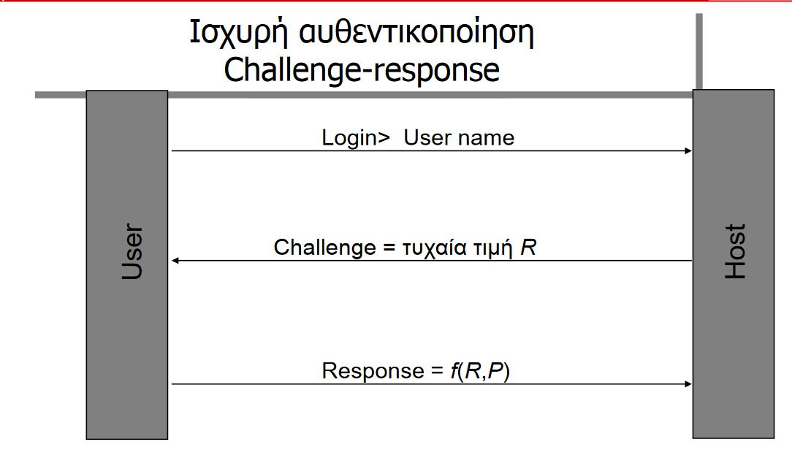

# Πιστοποίηση και ψηφιακά πιστοποιητικά

## Εισαγωγή

Επιτρέπει σε μια οντότητα να αποδείξει την ταυτότητα του σε μια άλλη οντότητα, **αποκαλύπτοντας τη γνώση** ενός μυστικού s στον ελεγκτή.

### Ισχυρή Αυθεντικοποίηση

η οντότητα αποκαλύπτει τη γνώση του s στον ελεγκτή **χωρίς να αποκαλύψει** το ίδιο το s στον ελεγκτή

## Χαρακτηριστικά

1. **Οντότητες** όπως χρήστες και ομάδες - προς προσδιορισμό ταυτότητας 
2. **Ιδιαίτερα Χαρακτηριστικά** -  ξεχωρισμός οντοτήτων
3. **Διαχειριστής / Ιδιοκτήτης** συστήματος - υπεύθυνος
4. **Μηχανισμός Αυθεντικοποίησης** - επαλήθευση
5. **Μηχανισμός ελέγχου πρόσβασης** - Παροχή προνομίων με επαλήθευση

## Απαιτήσεις

1. Η ανταλλαγή δεδομένων γίνεται με **αυθεντικοποιημένη** οντότητα
2. η οντότητα δεν είναι **μεταμφιεσμένη** και δεν συμβαίνει επανάληψη προηγούμενης σύνδεσης
3. Εξασφάλιση δεδομένων πως **είναι αυτά που είναι**
4. Προστασία ενάντια στις ψευδείς συναλλαγές

## Τεχνικές αυθεντικοποίησης

1. Αυθεντικοποίηση με **κάτι που έχει** ο χρήστης
    1. κάτι που **γνωρίζει** (pin)
    2. κάτι που **έχει ** (smart card)
2. Αυθεντικοποίηση με κάτι που **έιναι** ο χρήστης
   1. προσωπικά χαρακτηριστικά με βιομετρικές τεχνικές (δακτυλικό αποτύπωμα)
   2. με μια πράξη (υπογραφή)  

## Στοιχεία αυθεντικοποίησης

- Λειτουργία αυθεντικοποιήσης: Μέσα για επικύρωση μηνύματος
- Πρωτόκολλο αυθεντικοποιήσης: Επιτρέπει στο δέκτη να επικυρώσει το μήνυμα

### Λειτουργία Αυθεντικοποίησης

Χρήση
- Κρυπτογράφησης
- Συναρτήσεις κατακερματισμού (hash)

### Πρωτόκολλα Αυθεντικοποίησης
- Αμοιβαία αυθεντικοποίηση
  - Αμοιβαία επικύρωση της ταυτότητας
  - Συμφωνία επάνω στο κλειδί συνόδου
  - KDC,Kerberos
- Μονόδρομη αυθεντικοποίηση
  - email

### Ενδιάμσος Έμπιστος

- Αντιμετώπιση σε επιθέσεις Man in The Middle
- Κέντρο Διανομής Κλειδιών: ενας ενδιάμεσος έμπιστος που εκτελέι τη διανομή κλειδιών
- Αρχή Έκδοσης Πιστοποιητικών (Certification Authority - CA)

#### Κέντρο Διανομής Κλειδιών

Δημιουργεί την επικοινωνία δύο οντοτήτων οι οποίες δεν γνωρίζονται. Οι χρήστες εγγράφονται στο KDC έτσι ώστε να λειτουργήσει ως ενδιάμεσος μεταξύ τους.

#### Kerberos

Είναι ένα πρωτόκολλο Αυθεντικοποίησης Τρίτης Έμπιστης Πηγής. Λύνει το πρόβλημα της προσπέλασης υπηρεσιών διάφορων εξυπηρετητών κατανεμημένους στο δίκτυο μόνο από εξουσιοδοτημένους χρήστες.

Αποτελείται
- Authentication Server (AS): Αποθήκευση κωδικών χρηστών. Μοιράζεται ένα μοναδικό secret key με κάθε server.
- Kerberos Database: Συμμετρικό κλειδί για κάθε οντότητα
- Ticket Gathering Server (TGS): Έκδοση κουπονιών σε clients για επικοινωνία με network servers

## Διανομή κλειδιών και Πιστοποίηση

### Υποδομές Δημοσίου Κλειδιού - PKI

- Τρόπος οργάνωσης φυσικών υποδομών, εφαρμογών, διαχείρισης διαδικασιών σχετικά με ασφάλεια ΠΣ.
- Διαχείριση δημοσίων κλειδιών και πιστποιητικών
- Διαφάνεια: Οι χρήστες δεν χρειάζεται να ξέρουν τον τρόπο διαχείρισης κλειδιών

#### Διαδικασία

1. Δημιουργία ζεύγους ιδιωτικού/δημοσίου κλειδιού
2. Καταχώρηση σχέσης μεταξύ κλειδιού - οντότητας
3. Διανομή κλειδιών σε χρήστςε
4. Επιβεβαίωση ότι δεν έχει ανακληθεί και είναι έγκυρο
5. Ανάκληση Κλειδιού όταν έχει κλαπεί ή δεν είναι έγκυρο
6. Επαναφορά κλειδιού μέσω αντιγράφων σε περίπτωση απώλειας

#### Συστατικά

1. Πολιτική Ασφάλειας: Αρχές για την ασφάλεια και τη χρήση κρυπτογραφίας
2. Αρχή Πιστοποίησης: Διαχείριση ψηφιακών πιστοποιητικών
3. Αρχή Καταχώρησης: Διεπαφή μεταξύ του χρήστης και CA
4. Σύστημα διανομής πιστοποιητικών: Αποθήκευση πιστοποιητικών έκδοσης από CA
5. Συναλλαγές μέσω πιστωτικών καρτών

