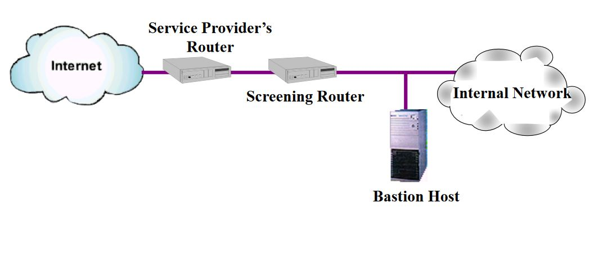
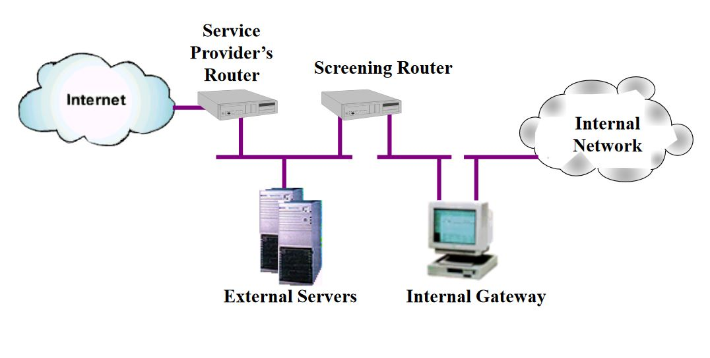

# Firewall

## Με λίγα λόγια
- Έμπιστο σύστημα μεταξύ δύο δικτύων
- Θέτει ζώνες εμπιστοσύνης
- Θεωρούμε το εσωτερικό δίκτυο ως **έμπιστο**
- Θεωρούμε το εξωτερικό δίκτυο ως **μη έμπιστο**
- Η πολιτική ασφάλειας ορίζει τι επιτρέπεται και τι όχι
- Εισερχόμενες συνδέσεις: Απαγορεύονται εκτός από αυτές που επιτρέπονται
- Εξερχόμενες συνδέσεις: Επιτρέπονται εκτός από αυτές που απαγορεύονται
- Αντιμετωπίζεται όλες οι επιθέσεις

## Γιατί Firewall?

- Ελέγχει και καταγράφει όλη τη ροή επικοινωνιών
- Κρύβει
- Αποτροπή επιθέσεων DoS
- Προστατεύει 
  - πόρους
  - κύρος
  - ομαλή λειτουργία

## Τεχνικές Προστασίας

- Πύλη φιλτραρίσματος πακέτων ή δρομολογητής (packet filtering gateway)
- Πύλη κυκλώματος (circuit gateways)
- Πύλη επιπέδου εφαρμογής (proxy)

### Φίλτρα Πακέτων (packet filters)

- Έλεγχος IP πακέτων
- Τοποθετείτι στο επίπεδο Δικτύου
- Το φίλτρο είναι ένα **σύνολο κανόνων** (rules)
- 2 βασικά τμήματα κανόνων
    1. Πεδίο ενέργειας
        - Επιτρέπω
        - Απαγορεύω
    2. Πεδίο κριτηρίων επιλογής
       - Διεύθυνση προέλευσης / προορισμού
       - Θύρα (poty) προέλευσης / προορισμού
       - Πρωτόκολλο
       - κατεύθυνση

#### Δρομολογητής φιλτραρίσματος (Screening Router)

- Απαγόρευση πρόσβασης σε **πόρτες κάτω του 1024**

| Πλεονεκτήματα | Μειονεκτήματα |
| :-- | :-- |
| Χαμηλό κόστος | Κρίσιμη η σειρά των κανόνων |
| Ευκολία | Δυσκολία υλοποίησης πολιτικών ελέγχου πρόσβασης |
| | Δυσκολία υλοποίησης ελέγχου σε επίπεδο εφαρμογής |
| | Έλλειψη δυνατότητας αυθεντικοποίησης |
| | Έλλειψη δυνατότητας καταγραφής |

### Πύλες Επιπέδου Εφαρμογής

- Θέση στο επίπεδο εφαρμογής
- Υποτηρίζουν σύνθετες πολιτικές ασφάλειας
- Κάθε TCP/IP υπηρεσία που ελέγχεται έχει το δικό του proxy, δηλαδή μια **υπηρεσία διαμεσολαβητή**
- Λογισμικό 2 κατευθύνσεων που δρα
  - Σαν διανομέας
  - Σαν πελάτης

| Πλεονεκτήματα |
| :-- |
| Ολοκληρωμένη ασφάλεια (Authentication, Logging, Accounting) |
| Εύκολη διαχείριση |
| Δυνατότητα ως φίλτρο πακέτων με χαμηλότερη επίδοση |

## Αρχιτεκτονική

### Multi-homed host

- Ένας host που διαθέτει περισσότερες από μια κάρτες δικτύου.
- Κάθε κάρτα είναι συνδεδεμένη σε subnet που είναι λογικά και φυσικά διαχωρισμένο
- Η πιο διαδεδομένη μοφή είναι με δυο κάρτες δικτύου (dual-homed host)

#### Dual-homed firewall

Η μια κάρτα είναι συνδεμένη στο εξωτερικό και μη έμπιστο Διαδίκτυο, ενώ η άλλη στο εσωτερικό και ασφαλές δίκτυο.  
Δεν πρέπει να επιτρέπεται η άμεση δρομολόγηση πακέτων μεταξύ των 2 δικτύων.

### Screened host

- Αποτελείται από
  1. Διακομιστής που καλείται οχυρό (bastion host)
  2. Filtering router
- Αποστολή **όλων** των αιτήσεων από εξωτερικό δίκτυο στο bastion host

### Screened subnet

- Σαν το screened host 
- Χρησιμοποιεί ένα δεύτερο δρομολογητή φιλτραρίσματος για διαχωρισμό μεταξύ bastion και υπάρχον δίκτυο (παραμετρικό δίκτυο), ως έξτρα επίπεδο προστασίας
- Πιθανό με 2 bastion hosts

## Πολιτική Ασφάλειας

Πίνακας ορισμού πολιτικής ασφάλειας. Για κάθε οντότητα, υπάρχουν κανόνες.

| Ορισμός αντικειμένων δικτύου | 
| :--: |
| Όνομα |
| IP Address |
| Σχόλια |
| Θέση στο δίκτυο (Εσωτερικό/Εξωτερικό) |
| Network Address Translation |

| Ορισμός χρηστών & ομάδων | 
| :--: |
| Όνομα |
| Λήξη λογαριασμού |
| Προσδιορισμός ταυτότητας (κλειδί) |
| Ομάδα που ανήκει |
| Θέση |
| Ώρα |
| Κρυπτογράφηση |

| Ορισμός υπηρεσιών | 
| :--: |
| standard internet services |
| Berkeley services rlogin |
| Sun rpc services |

| Καταγραφή κίνησης | 
| :--: |
| Σύντομη / Αναλυτική |

| Ενέργεια | 
| :--: |
| User authentication |
| Client authentication |
| Session authentication |
| Επιτρέπει |
| Απαγορεύει |

| Πλεονεκτήματα | Μειονεκτήματα |
| :-- | :-- |
| Εύκολη υλοποίηση | Δεν προστατεύουν από εσωτερικούς χρήστες |
| Προστασία από ευαίσθητα services | Δεν προστατεύουν από παράνομα ή παράλληλα κανάλια επικοινωνίας |
| Καταγραφή κίνησης | Παραβιάζονται |
| Κεντρική και κατανεμημένη εφαρμογή πολτικών ασφάλειας | Ιοί |

## VPN - Εικονικά Ιδιωτικά Δίκτυα

### Χαρακτηριστικά

- Διαθεσιμότητα
- Έλεγχος
- Συμβατότητα
- Διαλειτουργικότητα
- Αξιοπιστία
- Πιστοποίηση δεδομένων και χρηστών
- Επιβάρυνση φορίοτ
- Μη Απάρνηση

### NAT

- Συνηθισμένη χρήση όταν ο οργανισμός δεν έχει αρκετές νόμιμες IP
- Έξτρα μέτρο ασφάλειας 
- Απαιτείται μόνο νόμιμες διευθύνσεις στις δημόσιες Ίντερνετ υπηρεσίες
- Αρχιτεκτονικές
  - Many-to-1
  - 1-to-1
  - Proxies: many-to-1